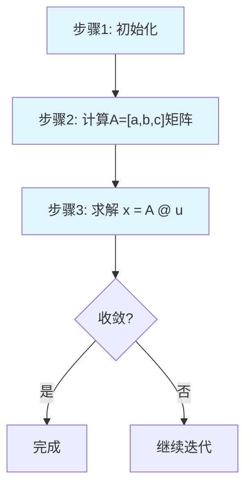

# PythonRobotics 学习项目目录说明

> 本目录包含 PythonRobotics 主项目和学习资料的完整环境

## 📁 目录结构

```
/home/zhufeng/code/PythonRobotics/
├── PythonRobotics/              # 📦 原始算法库项目
│   ├── PathPlanning/            # 路径规划算法（48个）
│   ├── PathTracking/            # 路径跟踪算法（8个）
│   ├── Localization/            # 定位算法（6个）
│   ├── SLAM/                    # SLAM算法（5个）
│   ├── Mapping/                 # 地图构建（13个）
│   ├── ArmNavigation/           # 机械臂导航
│   ├── AerialNavigation/        # 无人机导航
│   ├── utils/                   # 工具函数
│   └── README.md                # 项目说明
│
└── PythonRoboticsLearning/      # 📚 个人学习目录
    ├── notes/                   # 学习笔记（Markdown）
    │   └── 01_astar_algorithm.md
    ├── experiments/             # 实验代码
    │   └── astar_heuristic_comparison.py
    ├── code_snippets/           # 代码片段
    │   └── visualization_tools.py
    └── README.md                # 学习进度追踪
```

## 🎯 使用指南

### 对于 Claude Code (AI 助手)

当你在本项目中工作时：

#### 1. 理解两个目录的分工

**PythonRobotics/** - 原始算法库（只读学习）
- ✅ 阅读、理解算法实现
- ✅ 参考代码结构和设计模式
- ⚠️ **不要修改**：保持原始代码用于对比学习
- 📌 所有算法都可独立运行：`python3 PathPlanning/AStar/a_star.py`

**PythonRoboticsLearning/** - 学习实验区（读写）
- ✅ 编写学习笔记（notes/）
- ✅ 创建实验代码（experiments/）
- ✅ 收集有用的代码片段（code_snippets/）
- ✅ 修改和测试自己的想法

#### 2. 交互式学习流程

当用户要求学习某个算法时：

```
步骤 1: 定位算法文件
   示例: PythonRobotics/PathPlanning/AStar/a_star.py

步骤 2: 交互式讲解
   - 通过问答引导理解算法原理
   - 结合代码分析核心逻辑
   - 确认理解后进入下一个知识点

步骤 3: 手动笔记创建（可选）
   - 用户说："请根据我们关于xxx的讨论，创建笔记"
   - 创建/更新 notes/[算法名]_algorithm.md
   - 同算法多次讨论累积到同一文件

步骤 4: 更新学习进度
   - 在 PythonRoboticsLearning/README.md 记录
```

#### 3. 路径引用规则

**从实验代码导入原始模块**：
```python
# 方法 1: 使用 sys.path
import sys
sys.path.append('/home/zhufeng/code/PythonRobotics/PythonRobotics')
from PathPlanning.AStar import a_star

# 方法 2: 使用相对路径（如果从 PythonRobotics/ 运行）
from PathPlanning.AStar import a_star
```

**运行原始算法**：
```bash
# 必须在 PythonRobotics/ 目录下运行
cd /home/zhufeng/code/PythonRobotics/PythonRobotics
python3 PathPlanning/AStar/a_star.py

# 或作为模块运行
python3 -m PathPlanning.AStar.a_star
```

---

## 📚 学习资源位置

### 原始项目资源
- **主 README**: `PythonRobotics/README.md` - 算法总览
- **在线文档**: https://atsushisakai.github.io/PythonRobotics/
- **源代码**: `PythonRobotics/**/*.py`

### 学习资料
- **学习笔记**: `PythonRoboticsLearning/notes/`
- **实验记录**: `PythonRoboticsLearning/experiments/`
- **学习总览**: `PythonRoboticsLearning/README.md`

---

## 🔧 开发规范

### 文件修改原则

1. **原始代码 (PythonRobotics/)**:
   - ❌ 不修改原始算法文件
   - ✅ 仅阅读和理解
   - ✅ 需要修改时复制到 learning 目录

2. **学习代码 (PythonRoboticsLearning/)**:
   - ✅ 自由修改和实验
   - ✅ 创建变体和优化版本
   - ✅ 记录实验结果

3. **代码修改的文档规则**:
   - ⚠️ **临时修改不需要创建文档**
   - ✅ 只在用户明确要求时才创建说明文档
   - ✅ 代码注释应该足够清晰，不需要额外文档
   - ❌ 避免过度生成不必要的文档文件
   - ✅ 遵循"NEVER create files unless absolutely necessary"原则

### 测试和运行

**运行原始算法**：
```bash
cd PythonRobotics/PathPlanning/AStar
python3 a_star.py
```

**运行实验代码**：
```bash
cd PythonRoboticsLearning/experiments
python3 my_experiment.py
```

### 笔记格式

学习笔记应包含：
1. 算法原理（数学基础）
2. 代码结构分析（引用行号）
3. 实验记录（参数、结果）
4. 个人理解（心得、疑问）

模板：`PythonRoboticsLearning/notes/01_astar_algorithm.md`

### 实验和可视化规范

**重要：国际化要求**
- ⚠️ **所有 UI、图表、可视化只允许使用英文**
- ❌ 禁止在 matplotlib 标签、标题、图例中使用中文字符
- ✅ 使用英文标签：`plt.xlabel("Distance (m)")` 而不是 `plt.xlabel("距离（米）")`
- ✅ 使用英文标题：`plt.title("RRT Path Planning")` 而不是 `plt.title("RRT路径规划")`
- ✅ 使用英文图例：`plt.legend(["Path", "Obstacle"])` 而不是 `plt.legend(["路径", "障碍物"])`

**原因**：
- matplotlib 默认字体不支持中文，会导致乱码
- 英文标签更专业，便于国际交流
- 避免编码问题和字体依赖

---

## 🎓 学习路径参考

### 阶段 1: 基础算法（2-3周）
- `PythonRobotics/PathPlanning/AStar/`
- `PythonRobotics/PathPlanning/Dijkstra/`
- `PythonRobotics/PathPlanning/PotentialFieldPlanning/`

### 阶段 2: 采样算法（3-4周）
- `PythonRobotics/PathPlanning/RRT/`
- `PythonRobotics/PathPlanning/RRTStar/`
- `PythonRobotics/PathPlanning/HybridAStar/`

### 阶段 3: 控制与估计（2-3周）
- `PythonRobotics/PathTracking/LQRSteerControl/`
- `PythonRobotics/Localization/KalmanFilter/`
- `PythonRobotics/Localization/ExtendedKalmanFilter/`

### 阶段 4: SLAM（2-3周）
- `PythonRobotics/SLAM/EKFSLAM/`
- `PythonRobotics/SLAM/FastSLAM1.0/`
- `PythonRobotics/SLAM/GraphBasedSLAM/`

---

## 💡 快速参考

### 常用命令

```bash
# 查看某个算法
ls PythonRobotics/PathPlanning/

# 运行 A* 算法
cd PythonRobotics && python3 PathPlanning/AStar/a_star.py

# 查看学习进度
cat PythonRoboticsLearning/README.md

# 运行实验
cd PythonRoboticsLearning/experiments
python3 astar_heuristic_comparison.py
```

### Python 路径设置

```python
import sys
# 方法1: 绝对路径
sys.path.append('/home/zhufeng/code/PythonRobotics/PythonRobotics')

# 方法2: 相对路径（从 learning 目录）
sys.path.append('../PythonRobotics')
```

---

## 📊 学习进度追踪

当前学习状态请查看：`PythonRoboticsLearning/README.md`

包含：
- ✅ 已完成的算法
- 🚧 正在学习的内容
- 📅 计划学习的算法
- 📊 学习统计数据

---

## 📐 数学公式格式约定

### 数学表达式显示规则

为了保持项目文档的一致性和交流的高效性，请严格遵循以下约定：

#### 📄 文档内部（Markdown文件）
- ✅ **使用 LaTeX 格式**：`$$...$$`（块级）或 `$...$`（行内）
- ✅ **专业美观**：便于正式学习和技术交流
- ✅ **标准化**：符合学术和工程文档规范

**示例**：
```markdown
**线性化系统**：
$$\mathbf{x}[k+1] = \mathbf{A} \mathbf{x}[k] + \mathbf{B} \mathbf{u}[k] + \mathbf{C}$$

**代价函数**：
$$J = \sum_{t=0}^{T-1} \|\mathbf{x}_{\text{ref}}[t] - \mathbf{x}[t]\|^2_{\mathbf{Q}}$$
```

#### 💬 对话交流（Chat消息）
- ✅ **使用普通字符**：直观易读，输入快速
- ✅ **代码格式**：便于复制粘贴和快速理解
- ✅ **交流高效**：避免渲染延迟，适合实时讨论

**示例**：
```
线性化系统：x[k+1] = A*x[k] + B*u[k] + C
代价函数：J = sum(||x_ref[t] - x[t]||^2_Q)
```

或者：
```python
# 状态转移方程
x_next = A @ x + B @ u + C

# 代价函数（CVXPY格式）
cost += cvxpy.quad_form(x_ref - x, Q)
```

#### 🎯 适用场景

**文档中使用LaTeX**：
- 学习笔记文件（`notes/*.md`）
- 技术规范文档
- 算法推导说明
- 正式的项目文档

**对话中使用普通字符**：
- 实时技术讨论
- 代码调试交流
- 快速问答
- 概念澄清

#### ⚠️ 重要原则

1. **一致性**：同一上下文中保持格式统一
2. **可读性**：优先考虑目标受众的阅读体验
3. **实用性**：根据使用场景选择最合适的格式
4. **维护性**：便于后续修改和维护

★ **核心思想**：文档追求专业性，交流追求高效性

---

## 📊 图表格式规范

### Mermaid 流程图格式要求

为了确保Mermaid流程图能够正确解析和渲染，请严格遵循以下格式规则：

#### 🚨 节点标签格式 (CRITICAL)

**强制要求：所有包含特殊字符的节点标签必须用双引号包围**

```mermaid
# ❌ 错误格式 - 会导致解析错误
A[开始: 当前状态 x₀] --> B[初始化控制序列 u = [0,0,0,0,0]]

# ✅ 正确格式 - 双引号包围
A["开始: 当前状态 x₀"] --> B["初始化控制序列 u = [0,0,0,0,0]"]
```

#### 📋 需要双引号的特殊字符

**必须用双引号的情况**：
- `[]` 方括号：`["u = [0,0,0,0,0]"]`
- `{}` 花括号：`["{x,y,v,yaw}"]`
- `=` 等号：`["x = f(u)"]`
- `@` 符号：`["A @ x + B @ u"]`
- `≤≥` 不等号：`["v_min ≤ v ≤ v_max"]`
- `²` 上标：`["||x||²"]`
- 中文标点：`["步骤1：预测"]`

#### 🔧 最佳实践



#### ⚠️ 常见错误和解决方案

**错误1**: 方括号解析失败
```
错误: A[u = [0,0,0]] --> B[next step]
解决: A["u = [0,0,0]"] --> B["next step"]
```

**错误2**: 数学符号解析失败
```
错误: A[x ≤ y] --> B[A @ B]
解决: A["x ≤ y"] --> B["A @ B"]
```

**错误3**: 中文标点解析失败
```
错误: A[步骤1：开始] --> B[结果：完成]
解决: A["步骤1：开始"] --> B["结果：完成"]
```

#### 📝 检查清单

创建Mermaid图表时，请检查：
- [ ] 所有节点标签都用双引号包围
- [ ] 特殊字符（`[]=@≤≥²`）都在引号内
- [ ] 中文标点符号都在引号内
- [ ] 流程图语法正确
- [ ] 样式定义无语法错误

#### 💡 调试技巧

如果Mermaid解析失败：
1. 检查错误行附近的节点标签
2. 确认所有特殊字符都在双引号内
3. 验证流程图语法结构
4. 测试样式定义部分

---

## 🔗 重要提示

1. **两个目录的关系**：
   - `PythonRobotics/` = 参考书（只读）
   - `PythonRoboticsLearning/` = 笔记本和练习册（读写）

2. **文件引用**：
   - 从实验代码引用原始代码时注意路径
   - 使用相对路径 `../PythonRobotics` 更灵活

3. **版本控制**：
   - 原始项目有上游仓库
   - 学习目录是个人独立项目

4. **可执行性**：
   - 所有算法都是独立的 Python 脚本
   - 无需安装，直接运行（需依赖包）

---

## 🎯 给 Claude 的提示

当用户请求帮助时，应该：

1. **交互式算法学习**：
   - 在 `PythonRobotics/` 中找到对应算法文件
   - 通过问答方式引导用户理解算法原理
   - 结合代码分析进行深入讲解
   - 遵循交互式教学原则，确保理解后再进入下一步

2. **手动笔记创建**：
   - **仅在用户明确说"请根据我们上面关于xxx的讨论，创建笔记"时才创建笔记**
   - 笔记文件命名格式：`notes/[算法名]_algorithm.md`
   - 同一算法只能有一个笔记文件（支持多次会话累积更新）
   - 笔记内容：讨论总结、算法原理、代码要点、用户的理解程度

3. **算法文件引用**：
   - 使用 markdown 链接格式：`[filename.py](path/to/filename.py)`
   - 引用具体行号：`[filename.py:42](path/to/filename.py#L42)`
   - 帮助用户快速定位和理解代码

4. **学习进度跟踪**：
   - 更新 `PythonRoboticsLearning/README.md` 中的学习进度
   - 记录讨论过的算法和理解程度

## 🎓 交互式教学原则

### 📋 知识讲解规范

当进行知识讲解时，必须遵循以下交互式教学流程：

1. **分段教学**：
   - 将复杂概念分解为小的知识点
   - 每次只讲解一个核心概念
   - 避免一次性灌输过多信息

2. **确认理解**：
   - 讲解完每个知识点后，必须通过提问确认用户理解
   - 使用具体的问题检验掌握程度
   - 根据回答情况调整后续内容深度

3. **渐进式推进**：
   - 只有确认用户理解当前内容后，才能进入下一个知识点
   - 如果用户理解有偏差，先纠正再继续
   - 保持耐心，重复解释直到用户掌握

4. **实用问题设计**：
   - 问题应该检验理解，而非单纯重复概念
   - 结合具体例子和应用场景
   - 鼓励用户用自己的话解释概念

### 🎯 教学示例模式

```
Claude: [讲解知识点A]

现在让我确认你是否理解了这个概念：
- [具体问题1]
- 你能用自己的话解释一下 [概念] 吗？

用户: [回答]

Claude: [根据回答给出反馈]
- 如果正确：很好！现在我们继续下一个概念...
- 如果有误：让我换个角度解释一下...

[只有确认理解后才继续下一个知识点]
```

### ⚠️ 重要提醒

- **强制交互**：讲解知识时必须询问和确认，不能一口气讲完
- **个性化调整**：根据用户回答调整教学节奏和深度
- **实践结合**：理论讲解要结合代码实例和实际应用
- **耐心指导**：如果用户没理解，要耐心重复和换角度解释

---

**学习愉快！🚀**

有问题？查看 `PythonRoboticsLearning/README.md` 或原始项目文档。
