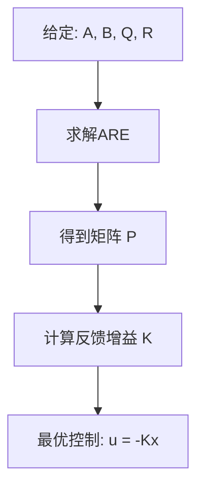

# LQR算法原理与推导：为什么核心是求解代数Riccati方程

> **作者**：学习笔记
> **日期**：2026-03-05
> **主题**：LQR (Linear Quadratic Regulator) 完整数学推导

---

## 📚 目录

1. [问题的提出](#1-问题的提出)
2. [动态规划方法](#2-动态规划方法)
3. [Hamilton-Jacobi-Bellman方程](#3-hamilton-jacobi-bellman方程)
4. [代数Riccati方程的推导](#4-代数riccati方程的推导)
5. [为什么ARE是核心](#5-为什么are是核心)
6. [数值求解方法](#6-数值求解方法)

---

## 1. 问题的提出

### 1.1 LQR问题描述

考虑线性离散系统：
$$\mathbf{x}[k+1] = \mathbf{A}\mathbf{x}[k] + \mathbf{B}\mathbf{u}[k]$$

代价函数（无限时域）：
$$J = \sum_{k=0}^{\infty} \left( \mathbf{x}[k]^T \mathbf{Q} \mathbf{x}[k] + \mathbf{u}[k]^T \mathbf{R} \mathbf{u}[k] \right)$$

**目标**：找到最优控制律 $\mathbf{u}^*[k]$ 使 $J$ 最小。

**目标层次1：找到最优控制序列**

给定初始状态 x[0]，找到控制序列：
{u*[0], u*[1], u*[2], ...} 使得 J = Σ(x^T Q x + u^T R u) 最小

**目标层次2：找到通用控制律（更重要！）**

找到一个反馈增益矩阵 K，使得对于任意初始状态 x[0]：
- 控制律：u*[k] = -K x[k]
- 都能实现最小代价


### 1.2 关键假设

1. **系统矩阵**：$(\mathbf{A}, \mathbf{B})$ 可控
2. **权重矩阵**：$\mathbf{Q} \succeq 0$（半正定），$\mathbf{R} \succ 0$（正定）
3. **时域**：无限时域（$k \to \infty$）
4. **线性**：系统动力学线性，代价函数二次

---

## 2. 动态规划方法

### 2.1 值函数定义

定义值函数（从时刻 $k$ 到无穷大的最小代价）：
$$V(\mathbf{x}[k]) = \min_{\{\mathbf{u}[j]\}_{j=k}^{\infty}} \sum_{j=k}^{\infty} \left( \mathbf{x}[j]^T \mathbf{Q} \mathbf{x}[j] + \mathbf{u}[j]^T \mathbf{R} \mathbf{u}[j] \right)$$

### 2.2 Bellman最优性原理

**核心思想**：最优策略的任何子策略也是最优的。

数学表达：
$$V(\mathbf{x}[k]) = \min_{\mathbf{u}[k]} \left\{ \mathbf{x}[k]^T \mathbf{Q} \mathbf{x}[k] + \mathbf{u}[k]^T \mathbf{R} \mathbf{u}[k] + V(\mathbf{x}[k+1]) \right\}$$

其中：$\mathbf{x}[k+1] = \mathbf{A}\mathbf{x}[k] + \mathbf{B}\mathbf{u}[k]$

### 2.3 值函数的假设形式

**关键洞察**：对于线性系统和二次代价，值函数应该是二次的！

**这不是假设，而是数学推导的必然结果！**

假设：
$$V(\mathbf{x}) = \mathbf{x}^T \mathbf{P} \mathbf{x}$$

其中 $\mathbf{P}$ 是待求的正定矩阵。

### 2.4 为什么值函数必须是二次的：归纳法证明

**定理**：对于线性系统和二次代价，最优值函数必然具有二次形式。

**证明（有限时域归纳法）**：

**步骤1：终端时刻（k=N）**

终端代价：$V_N(\mathbf{x}[N]) = \mathbf{x}[N]^T \mathbf{Q}_f \mathbf{x}[N]$

显然：$V_N(\mathbf{x})$ 是二次函数 ✅

**步骤2：倒数第二步（k=N-1）**

Bellman方程：
$$V_{N-1}(\mathbf{x}) = \min_{\mathbf{u}} \left\{ \mathbf{x}^T \mathbf{Q} \mathbf{x} + \mathbf{u}^T \mathbf{R} \mathbf{u} + V_N(\mathbf{A}\mathbf{x} + \mathbf{B}\mathbf{u}) \right\}$$

代入$V_N$：
$$V_{N-1}(\mathbf{x}) = \min_{\mathbf{u}} \left\{ \mathbf{x}^T \mathbf{Q} \mathbf{x} + \mathbf{u}^T \mathbf{R} \mathbf{u} + (\mathbf{A}\mathbf{x} + \mathbf{B}\mathbf{u})^T \mathbf{Q}_f (\mathbf{A}\mathbf{x} + \mathbf{B}\mathbf{u}) \right\}$$

展开 $(\mathbf{A}\mathbf{x} + \mathbf{B}\mathbf{u})^T \mathbf{Q}_f (\mathbf{A}\mathbf{x} + \mathbf{B}\mathbf{u})$：
$$= \mathbf{x}^T \mathbf{A}^T \mathbf{Q}_f \mathbf{A} \mathbf{x} + 2\mathbf{u}^T \mathbf{B}^T \mathbf{Q}_f \mathbf{A} \mathbf{x} + \mathbf{u}^T \mathbf{B}^T \mathbf{Q}_f \mathbf{B} \mathbf{u}$$

（注：由于最终结果为标量，且 $\mathbf{Q}_f$ 为对称阵，交叉项 $\mathbf{x}^T \mathbf{A}^T \mathbf{Q}_f \mathbf{B} \mathbf{u} = \mathbf{u}^T \mathbf{B}^T \mathbf{Q}_f \mathbf{A} \mathbf{x}$。为方便应用分母布局对 $\mathbf{u}$ 求导，这里写为后者形式）

因此：
$$V_{N-1}(\mathbf{x}) = \min_{\mathbf{u}} \left\{ \mathbf{x}^T(\mathbf{Q} + \mathbf{A}^T \mathbf{Q}_f \mathbf{A})\mathbf{x} + 2\mathbf{u}^T \mathbf{B}^T \mathbf{Q}_f \mathbf{A} \mathbf{x} + \mathbf{u}^T(\mathbf{R} + \mathbf{B}^T \mathbf{Q}_f \mathbf{B})\mathbf{u} \right\}$$

这是关于$\mathbf{u}$的二次优化问题！

**重要：为什么可以通过求偏导得到全局最优？**

**必要条件验证**：

1. **函数可微性** ✅
   目标函数是$\mathbf{u}$的多项式，处处可微

2. **凸函数判断** ✅
   目标函数对$\mathbf{u}$的Hessian矩阵：
   $$\mathbf{H}_{uu} = \frac{\partial^2 J}{\partial \mathbf{u}^2} = 2(\mathbf{R} + \mathbf{B}^T \mathbf{Q}_f \mathbf{B})$$

   由于$\mathbf{R} \succ 0$（正定）且$\mathbf{Q}_f \succeq 0$（半正定），所以：
   $$\mathbf{H}_{uu} = 2(\mathbf{R} + \mathbf{B}^T \mathbf{Q}_f \mathbf{B}) \succ 0$$

   Hessian矩阵正定 → 目标函数严格凸

3. **最优性条件** ✅
   对于严格凸函数，一阶必要条件即是充分条件。下面给出严谨的**代数证明**（为什么求偏导为0就能保证是全局唯一最优解）。

   假设目标函数具有通用的二次多项式形式：
   $$J(\mathbf{u}) = \frac{1}{2}\mathbf{u}^T \mathbf{H} \mathbf{u} + \mathbf{c}^T \mathbf{u} + const$$
   
   其中 $\mathbf{H} = 2(\mathbf{R} + \mathbf{B}^T \mathbf{Q}_f \mathbf{B}) \succ 0$ 是对称正定矩阵，$\mathbf{c} = 2\mathbf{B}^T \mathbf{Q}_f \mathbf{A} \mathbf{x}$。

   **先通过求偏导数得到候选最优点 $\mathbf{u}^*$：**
   对目标函数求梯度并令其为0：
   $$\nabla_{\mathbf{u}} J = \mathbf{H} \mathbf{u} + \mathbf{c} = 0 \Rightarrow \mathbf{H} \mathbf{u}^* = -\mathbf{c}$$

   **证明“偏导为0即全局最优”：**
   设任意其他控制输入为 $\mathbf{u} = \mathbf{u}^* + \Delta \mathbf{u}$（其中 $\Delta \mathbf{u} \neq 0$）。
   将其代入目标函数 $J(\mathbf{u})$ 中展开：
   $$J(\mathbf{u}^* + \Delta \mathbf{u}) = \frac{1}{2}(\mathbf{u}^* + \Delta \mathbf{u})^T \mathbf{H} (\mathbf{u}^* + \Delta \mathbf{u}) + \mathbf{c}^T (\mathbf{u}^* + \Delta \mathbf{u})$$
   $$= \underbrace{\left( \frac{1}{2}{\mathbf{u}^*}^T \mathbf{H} \mathbf{u}^* + \mathbf{c}^T \mathbf{u}^* \right)}_{\text{正是 } J(\mathbf{u}^*)} + \frac{1}{2}{\mathbf{u}^*}^T \mathbf{H} \Delta \mathbf{u} + \frac{1}{2}{\Delta \mathbf{u}}^T \mathbf{H} \mathbf{u}^* + \frac{1}{2}{\Delta \mathbf{u}}^T \mathbf{H} \Delta \mathbf{u} + \mathbf{c}^T \Delta \mathbf{u}$$

   由于 $\mathbf{H}$ 是对称矩阵（$\mathbf{H}^T = \mathbf{H}$），可知 ${\mathbf{u}^*}^T \mathbf{H} \Delta \mathbf{u} = {\Delta \mathbf{u}}^T \mathbf{H} \mathbf{u}^*$。因此可以合并线性项：
   $$= J(\mathbf{u}^*) + \underbrace{({\mathbf{u}^*}^T \mathbf{H} + \mathbf{c}^T)}_{\text{此项为0}} \Delta \mathbf{u} + \frac{1}{2}{\Delta \mathbf{u}}^T \mathbf{H} \Delta \mathbf{u}$$

   因为 $\mathbf{H} \mathbf{u}^* = -\mathbf{c}$，所以转置后有 ${\mathbf{u}^*}^T \mathbf{H}^T = {\mathbf{u}^*}^T \mathbf{H} = -\mathbf{c}^T$，即 ${\mathbf{u}^*}^T \mathbf{H} + \mathbf{c}^T = 0$。中间包含 $\Delta \mathbf{u}$ 的线性项**完美抵消为0**。

   等式化简为：
   $$J(\mathbf{u}^* + \Delta \mathbf{u}) = J(\mathbf{u}^*) + \frac{1}{2}{\Delta \mathbf{u}}^T \mathbf{H} \Delta \mathbf{u}$$

   最后，利用**Hessian矩阵正定性**的条件：由于 $\mathbf{H} \succ 0$，对于任意非零向量 $\Delta \mathbf{u} \neq 0$，永远有 $\frac{1}{2}{\Delta \mathbf{u}}^T \mathbf{H} \Delta \mathbf{u} > 0$。

   因此严格得出结论：
   $$J(\mathbf{u}^* + \Delta \mathbf{u}) > J(\mathbf{u}^*)$$
   
   无论在 $\mathbf{u}^*$ 基础上作何微小偏移，代价 $J$ **一定会严格变大**。这就是为什么当 $\mathbf{H}$ 正定时，令一阶偏导=0算出的不仅是极值，而且是**唯一的全局最小值**。

   

**因此可以对$\mathbf{u}$求偏导（采用分母布局）：**
$$\frac{\partial J}{\partial \mathbf{u}} = 2\mathbf{B}^T \mathbf{Q}_f \mathbf{A} \mathbf{x} + 2(\mathbf{R} + \mathbf{B}^T \mathbf{Q}_f \mathbf{B}) \mathbf{u} = 0$$

解得最优控制：
$$\mathbf{u}^* = -(\mathbf{R} + \mathbf{B}^T \mathbf{Q}_f \mathbf{B})^{-1} \mathbf{B}^T \mathbf{Q}_f \mathbf{A} \mathbf{x}$$

**将最优控制 $\mathbf{u}^*$ 代入回值函数：**
已知代价函数的表达式为：
$$V_{N-1}(\mathbf{x}) = \mathbf{x}^T(\mathbf{Q} + \mathbf{A}^T \mathbf{Q}_f \mathbf{A})\mathbf{x} + 2{\mathbf{u}^*}^T \mathbf{B}^T \mathbf{Q}_f \mathbf{A} \mathbf{x} + {\mathbf{u}^*}^T(\mathbf{R} + \mathbf{B}^T \mathbf{Q}_f \mathbf{B})\mathbf{u}^*$$

为了方便化简，我们观察先前的极值条件：
$$(\mathbf{R} + \mathbf{B}^T \mathbf{Q}_f \mathbf{B}) \mathbf{u}^* = -\mathbf{B}^T \mathbf{Q}_f \mathbf{A} \mathbf{x}$$

将其直接代入代价函数的第三项中：
$${\mathbf{u}^*}^T \left[ (\mathbf{R} + \mathbf{B}^T \mathbf{Q}_f \mathbf{B}) \mathbf{u}^* \right] = {\mathbf{u}^*}^T \left[ -\mathbf{B}^T \mathbf{Q}_f \mathbf{A} \mathbf{x} \right] = -{\mathbf{u}^*}^T \mathbf{B}^T \mathbf{Q}_f \mathbf{A} \mathbf{x}$$

这与第二项刚好可以部分抵消：
$$2{\mathbf{u}^*}^T \mathbf{B}^T \mathbf{Q}_f \mathbf{A} \mathbf{x} - {\mathbf{u}^*}^T \mathbf{B}^T \mathbf{Q}_f \mathbf{A} \mathbf{x} = {\mathbf{u}^*}^T \mathbf{B}^T \mathbf{Q}_f \mathbf{A} \mathbf{x}$$

此时 $V_{N-1}(\mathbf{x})$ 大大简化为：
$$V_{N-1}(\mathbf{x}) = \mathbf{x}^T(\mathbf{Q} + \mathbf{A}^T \mathbf{Q}_f \mathbf{A})\mathbf{x} + {\mathbf{u}^*}^T \mathbf{B}^T \mathbf{Q}_f \mathbf{A} \mathbf{x}$$

现在，将 $\mathbf{u}^*$ 表达式的转置代回（注意包含对称矩阵的转置运算规律）：
$${\mathbf{u}^*}^T = -\mathbf{x}^T \mathbf{A}^T \mathbf{Q}_f \mathbf{B} (\mathbf{R} + \mathbf{B}^T \mathbf{Q}_f \mathbf{B})^{-1}$$

代入得到：
$$V_{N-1}(\mathbf{x}) = \mathbf{x}^T(\mathbf{Q} + \mathbf{A}^T \mathbf{Q}_f \mathbf{A})\mathbf{x} - \mathbf{x}^T \mathbf{A}^T \mathbf{Q}_f \mathbf{B} (\mathbf{R} + \mathbf{B}^T \mathbf{Q}_f \mathbf{B})^{-1} \mathbf{B}^T \mathbf{Q}_f \mathbf{A} \mathbf{x}$$

提取首尾的 $\mathbf{x}^T$ 和 $\mathbf{x}$，即可表示为纯粹的二次型形式：
$$V_{N-1}(\mathbf{x}) = \mathbf{x}^T \mathbf{P}_{N-1} \mathbf{x}$$

其中核心矩阵 $\mathbf{P}_{N-1}$ 即为：
$$\mathbf{P}_{N-1} = \mathbf{Q} + \mathbf{A}^T \mathbf{Q}_f \mathbf{A} - \mathbf{A}^T \mathbf{Q}_f \mathbf{B}(\mathbf{R} + \mathbf{B}^T \mathbf{Q}_f \mathbf{B})^{-1} \mathbf{B}^T \mathbf{Q}_f \mathbf{A}$$

**结论**：$V_{N-1}(\mathbf{x})$ 也是二次函数！✅

**步骤3：数学归纳**

**归纳假设**：如果 $V_{k+1}(\mathbf{x}) = \mathbf{x}^T \mathbf{P}_{k+1} \mathbf{x}$ 是二次的

**证明** $V_k(\mathbf{x})$ 也是二次的：

$$V_k(\mathbf{x}) = \min_{\mathbf{u}} \left\{ \mathbf{x}^T \mathbf{Q} \mathbf{x} + \mathbf{u}^T \mathbf{R} \mathbf{u} + V_{k+1}(\mathbf{A}\mathbf{x} + \mathbf{B}\mathbf{u}) \right\}$$
$$= \min_{\mathbf{u}} \left\{ \mathbf{x}^T \mathbf{Q} \mathbf{x} + \mathbf{u}^T \mathbf{R} \mathbf{u} + (\mathbf{A}\mathbf{x} + \mathbf{B}\mathbf{u})^T \mathbf{P}_{k+1} (\mathbf{A}\mathbf{x} + \mathbf{B}\mathbf{u}) \right\}$$

按照同样的展开和优化过程，得到：
$$V_k(\mathbf{x}) = \mathbf{x}^T \mathbf{P}_k \mathbf{x}$$

其中 $\mathbf{P}_k$ 满足递推关系：
$$\mathbf{P}_k = \mathbf{Q} + \mathbf{A}^T \mathbf{P}_{k+1} \mathbf{A} - \mathbf{A}^T \mathbf{P}_{k+1} \mathbf{B}(\mathbf{R} + \mathbf{B}^T \mathbf{P}_{k+1} \mathbf{B})^{-1} \mathbf{B}^T \mathbf{P}_{k+1} \mathbf{A}$$

**归纳结论**：所有有限步的值函数都是二次的！

**推广到无限时域**：
当 $N \to \infty$ 且系统稳定时，$\mathbf{P}_k$ 收敛到常数矩阵 $\mathbf{P}$，满足：
$$\mathbf{P} = \mathbf{Q} + \mathbf{A}^T \mathbf{P} \mathbf{A} - \mathbf{A}^T \mathbf{P} \mathbf{B}(\mathbf{R} + \mathbf{B}^T \mathbf{P} \mathbf{B})^{-1} \mathbf{B}^T \mathbf{P} \mathbf{A}$$

这就是**离散代数Riccati方程**！□

**核心洞察**：二次形式不是假设，而是线性系统+二次代价的数学必然性！

---

## 3. Hamilton-Jacobi-Bellman方程

### 3.1 HJB方程推导

将值函数假设代入Bellman方程：

$$\mathbf{x}^T \mathbf{P} \mathbf{x} = \min_{\mathbf{u}} \left\{ \mathbf{x}^T \mathbf{Q} \mathbf{x} + \mathbf{u}^T \mathbf{R} \mathbf{u} + (\mathbf{A}\mathbf{x} + \mathbf{B}\mathbf{u})^T \mathbf{P} (\mathbf{A}\mathbf{x} + \mathbf{B}\mathbf{u}) \right\}$$

### 3.2 展开二次项

$$(\mathbf{A}\mathbf{x} + \mathbf{B}\mathbf{u})^T \mathbf{P} (\mathbf{A}\mathbf{x} + \mathbf{B}\mathbf{u}) = \mathbf{x}^T \mathbf{A}^T \mathbf{P} \mathbf{A} \mathbf{x} + 2\mathbf{u}^T \mathbf{B}^T \mathbf{P} \mathbf{A} \mathbf{x} + \mathbf{u}^T \mathbf{B}^T \mathbf{P} \mathbf{B} \mathbf{u}$$

### 3.3 完整目标函数

$$J(\mathbf{u}) = \mathbf{x}^T \mathbf{Q} \mathbf{x} + \mathbf{u}^T \mathbf{R} \mathbf{u} + \mathbf{x}^T \mathbf{A}^T \mathbf{P} \mathbf{A} \mathbf{x} + 2\mathbf{u}^T \mathbf{B}^T \mathbf{P} \mathbf{A} \mathbf{x} + \mathbf{u}^T \mathbf{B}^T \mathbf{P} \mathbf{B} \mathbf{u}$$

整理得：
$$J(\mathbf{u}) = \mathbf{x}^T (\mathbf{Q} + \mathbf{A}^T \mathbf{P} \mathbf{A}) \mathbf{x} + 2\mathbf{u}^T \mathbf{B}^T \mathbf{P} \mathbf{A} \mathbf{x} + \mathbf{u}^T (\mathbf{R} + \mathbf{B}^T \mathbf{P} \mathbf{B}) \mathbf{u}$$

---

## 4. 代数Riccati方程的推导

### 4.1 最优控制求解

对 $J(\mathbf{u})$ 关于 $\mathbf{u}$ 求偏导（采用分母布局）：
$$\frac{\partial J}{\partial \mathbf{u}} = 2\mathbf{B}^T \mathbf{P} \mathbf{A} \mathbf{x} + 2(\mathbf{R} + \mathbf{B}^T \mathbf{P} \mathbf{B}) \mathbf{u}$$

令偏导数为零：
$$2\mathbf{B}^T \mathbf{P} \mathbf{A} \mathbf{x} + 2(\mathbf{R} + \mathbf{B}^T \mathbf{P} \mathbf{B}) \mathbf{u}^* = 0$$

解得最优控制律：
$$\mathbf{u}^* = -(\mathbf{R} + \mathbf{B}^T \mathbf{P} \mathbf{B})^{-1} \mathbf{B}^T \mathbf{P} \mathbf{A} \mathbf{x}$$

定义反馈增益矩阵：
$$\mathbf{K} = (\mathbf{R} + \mathbf{B}^T \mathbf{P} \mathbf{B})^{-1} \mathbf{B}^T \mathbf{P} \mathbf{A}$$

因此：
$$\mathbf{u}^* = -\mathbf{K} \mathbf{x}$$

### 4.2 最优值函数

将最优控制 $\mathbf{u}^* = -\mathbf{K} \mathbf{x}$ 代入目标函数。
在这之前，我们可以先利用极值的性质进行化简。已知的目标函数为：
$$J(\mathbf{u}) = \mathbf{x}^T (\mathbf{Q} + \mathbf{A}^T \mathbf{P} \mathbf{A}) \mathbf{x} + 2{\mathbf{u}^*}^T \mathbf{B}^T \mathbf{P} \mathbf{A} \mathbf{x} + {\mathbf{u}^*}^T (\mathbf{R} + \mathbf{B}^T \mathbf{P} \mathbf{B}) \mathbf{u}^*$$

利用驻点条件 $(\mathbf{R} + \mathbf{B}^T \mathbf{P} \mathbf{B}) \mathbf{u}^* = -\mathbf{B}^T \mathbf{P} \mathbf{A} \mathbf{x}$，将其代入最后一项：
$${\mathbf{u}^*}^T \left[ (\mathbf{R} + \mathbf{B}^T \mathbf{P} \mathbf{B}) \mathbf{u}^* \right] = -{\mathbf{u}^*}^T \mathbf{B}^T \mathbf{P} \mathbf{A} \mathbf{x}$$

此项与第二项部分抵消：
$$2{\mathbf{u}^*}^T \mathbf{B}^T \mathbf{P} \mathbf{A} \mathbf{x} - {\mathbf{u}^*}^T \mathbf{B}^T \mathbf{P} \mathbf{A} \mathbf{x} = {\mathbf{u}^*}^T \mathbf{B}^T \mathbf{P} \mathbf{A} \mathbf{x}$$

所以代入最优控制后的代价函数 $V(\mathbf{x})$ 简化为：
$$V(\mathbf{x}) = \mathbf{x}^T (\mathbf{Q} + \mathbf{A}^T \mathbf{P} \mathbf{A}) \mathbf{x} + {\mathbf{u}^*}^T \mathbf{B}^T \mathbf{P} \mathbf{A} \mathbf{x}$$

再将 ${\mathbf{u}^*}^T = -\mathbf{x}^T \mathbf{K}^T = -\mathbf{x}^T \mathbf{A}^T \mathbf{P} \mathbf{B} (\mathbf{R} + \mathbf{B}^T \mathbf{P} \mathbf{B})^{-1}$ 代回：
$$V(\mathbf{x}) = \mathbf{x}^T (\mathbf{Q} + \mathbf{A}^T \mathbf{P} \mathbf{A}) \mathbf{x} - \mathbf{x}^T \mathbf{A}^T \mathbf{P} \mathbf{B} (\mathbf{R} + \mathbf{B}^T \mathbf{P} \mathbf{B})^{-1} \mathbf{B}^T \mathbf{P} \mathbf{A} \mathbf{x}$$

提取公共项 $\mathbf{x}^T$ 和 $\mathbf{x}$，可以化简为：
$$V(\mathbf{x}) = \mathbf{x}^T \left[ \mathbf{Q} + \mathbf{A}^T \mathbf{P} \mathbf{A} - \mathbf{A}^T \mathbf{P} \mathbf{B} (\mathbf{R} + \mathbf{B}^T \mathbf{P} \mathbf{B})^{-1} \mathbf{B}^T \mathbf{P} \mathbf{A} \right] \mathbf{x}$$

### 4.3 代数Riccati方程（ARE）

由于 $V(\mathbf{x}) = \mathbf{x}^T \mathbf{P} \mathbf{x}$，系数必须相等：

$$\mathbf{P} = \mathbf{Q} + \mathbf{A}^T \mathbf{P} \mathbf{A} - \mathbf{A}^T \mathbf{P} \mathbf{B} (\mathbf{R} + \mathbf{B}^T \mathbf{P} \mathbf{B})^{-1} \mathbf{B}^T \mathbf{P} \mathbf{A}$$

这就是**离散代数Riccati方程**！

---

## 5. 为什么ARE是核心

### 5.1 数学原因

1. **唯一性**：在可控可观测条件下，ARE有唯一正定解
2. **存在性**：稳定系统保证解的存在
3. **最优性**：ARE的解 $\mathbf{P}$ 直接给出最优反馈增益

### 5.2 物理含义

**$\mathbf{P}$ 矩阵的含义**：
- $\mathbf{P}$ 编码了"从当前状态到无穷远的最优代价"
- $V(\mathbf{x}) = \mathbf{x}^T \mathbf{P} \mathbf{x}$ 是状态的二次函数
- $\mathbf{P}$ 的特征值反映了系统在不同方向上的"控制代价"

### 5.3 算法流程



**关键洞察**：
- 一旦求出 $\mathbf{P}$，整个LQR问题就解决了！
- 不需要在线优化，只需要矩阵乘法：$\mathbf{u} = -\mathbf{K}\mathbf{x}$

---

## 6. 数值求解方法

### 6.1 迭代方法（值迭代）

从任意正定矩阵 $\mathbf{P}_0$ 开始：

$$\mathbf{P}_{i+1} = \mathbf{Q} + \mathbf{A}^T \mathbf{P}_i \mathbf{A} - \mathbf{A}^T \mathbf{P}_i \mathbf{B} (\mathbf{R} + \mathbf{B}^T \mathbf{P}_i \mathbf{B})^{-1} \mathbf{B}^T \mathbf{P}_i \mathbf{A}$$

收敛条件：$\|\mathbf{P}_{i+1} - \mathbf{P}_i\| < \epsilon$

### 6.2 直接求解方法

**Schur方法**：将ARE转化为广义特征值问题
$$\mathbf{Z} = \begin{bmatrix} \mathbf{A} + \mathbf{B}\mathbf{R}^{-1}\mathbf{B}^T\mathbf{P} & -\mathbf{B}\mathbf{R}^{-1}\mathbf{B}^T \\ -\mathbf{Q} & \mathbf{A}^T \end{bmatrix}$$

Python实现：
```python
from scipy.linalg import solve_discrete_are

P = solve_discrete_are(A, B, Q, R)
K = np.linalg.inv(R + B.T @ P @ B) @ (B.T @ P @ A)
```

---

## 7. Bellman最优性原理的数学证明

### 7.1 定理陈述

**Bellman最优性原理**：最优策略的任何子策略也是最优的。

**数学表达**：如果策略$\pi^* = \{u^*[0], u^*[1], u^*[2], ...\}$是从状态$x[0]$开始的最优策略，那么子策略$\{u^*[k], u^*[k+1], ...\}$必须是从状态$x[k]$开始的最优策略。

### 7.2 反证法证明

**步骤1：反假设**

假设存在反例：
- 策略$\pi^* = \{u^*[0], u^*[1], u^*[2], ...\}$是从$x[0]$的全局最优策略
- 但子策略$\pi_k^* = \{u^*[k], u^*[k+1], ...\}$**不是**从$x[k]$的最优策略

这意味着存在另一个策略$\tilde{\pi}_k = \{\tilde{u}[k], \tilde{u}[k+1], ...\}$从状态$x[k]$开始有更小的代价。

**步骤2：构造矛盾策略**

构造新策略$\hat{\pi}$：
$$\hat{\pi} = \{u^*[0], u^*[1], ..., u^*[k-1], \tilde{u}[k], \tilde{u}[k+1], ...\}$$

即：前$k$步使用原最优策略，从第$k$步开始使用更好的策略$\tilde{\pi}_k$。

**步骤3：代价计算**

原策略$\pi^*$的总代价：
$$J(\pi^*) = \sum_{j=0}^{k-1} c(x[j], u^*[j]) + \sum_{j=k}^{\infty} c(x[j], u^*[j]) = J_{0:k-1}^* + J_{k:\infty}^*$$

新策略$\hat{\pi}$的总代价：
$$J(\hat{\pi}) = \sum_{j=0}^{k-1} c(x[j], u^*[j]) + \sum_{j=k}^{\infty} c(x[j], \tilde{u}[j]) = J_{0:k-1}^* + \tilde{J}_{k:\infty}$$

**步骤4：得出矛盾**

根据反假设，$\tilde{\pi}_k$从$x[k]$开始更优：$\tilde{J}_{k:\infty} < J_{k:\infty}^*$

因此：$J(\hat{\pi}) = J_{0:k-1}^* + \tilde{J}_{k:\infty} < J_{0:k-1}^* + J_{k:\infty}^* = J(\pi^*)$

这意味着$\hat{\pi}$比$\pi^*$更好，**矛盾**了$\pi^*$是最优策略的假设！

**结论**：最优策略的任何子策略必须也是最优的。□

### 7.3 为什么动态规划不会陷入局部最优

**关键理解：反向递推的全局性**

动态规划通过**反向递推**构建最优解：

$$V^*(x[k]) = \min_{u[k]} \left\{ c(x[k], u[k]) + V^*(x[k+1]) \right\}$$

**核心特点**：
1. **$V^*(x[k+1])$已经是全局最优**：在计算$V^*(x[k])$时，我们已经知道从任何$x[k+1]$开始的最优策略
2. **枚举所有可能性**：$\min_{u[k]}$考虑了所有可能的控制输入
3. **无局部搜索**：不存在"搜索方向"的概念，而是直接计算最优值

**与传统优化的区别**：

| 特性         | 传统优化             | 动态规划         |
| ------------ | -------------------- | ---------------- |
| **搜索方式** | 在参数空间中搜索     | 通过递归关系构建 |
| **局部最优** | 可能陷入局部最优     | 不存在局部最优   |
| **全局信息** | 依赖初始点和搜索方向 | 自动包含全局信息 |
| **计算方式** | 梯度下降等迭代方法   | 递归计算确定值   |

---

## 💡 核心要点总结

### 为什么ARE是LQR的核心？

1. **数学核心**：ARE将动态规划的无穷维优化问题转化为有限维代数问题
2. **计算核心**：求解ARE得到 $\mathbf{P}$，直接计算最优反馈增益
3. **理论核心**：ARE的解保证了闭环系统的稳定性和最优性
4. **实现核心**：一次求解ARE，终身使用线性反馈控制

### LQR vs MPC的联系

| 特性       | LQR                                  | MPC              |
| ---------- | ------------------------------------ | ---------------- |
| **时域**   | 无限时域                             | 有限时域         |
| **约束**   | 无约束                               | 有约束           |
| **求解**   | 离线求解ARE                          | 在线求解QP       |
| **控制律** | $\mathbf{u} = -\mathbf{K}\mathbf{x}$ | 优化得到控制序列 |
| **计算量** | 极低（矩阵乘法）                     | 较高（QP求解）   |

**关键联系**：
- MPC的终端代价矩阵通常选择为LQR的ARE解
- 无约束MPC等价于LQR
- MPC可以看作"带约束的有限时域LQR"

---

## 🧮 数学推导的精髓

**整个推导的逻辑链条**：

```
动态规划原理 → 值函数假设(二次) → HJB方程 → 最优控制求解 → ARE推导 → 反馈增益计算
```

每一步都是数学上的必然结果，ARE不是人为构造的，而是从最优控制理论自然推导出来的结果！

这就是为什么ARE是LQR算法的绝对核心 —— 它是连接"最优性"与"可计算性"的桥梁。