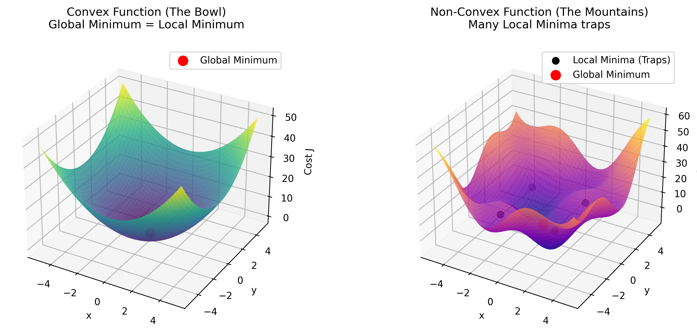
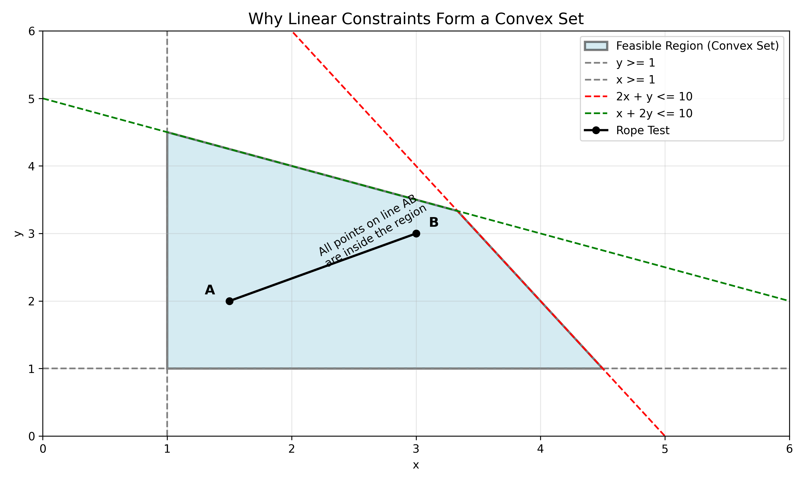
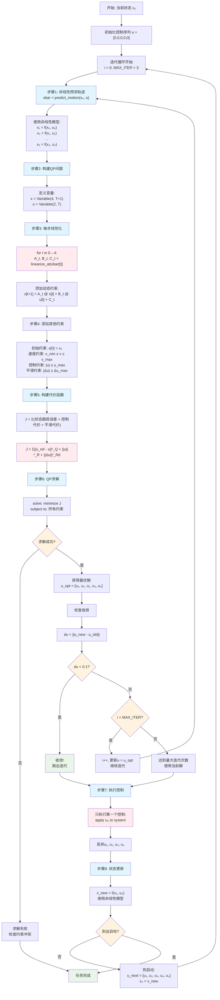

# 模型预测控制（MPC）学习笔记

> **学习日期**: 2026-02-09
> **算法类别**: 路径跟踪与最优控制
> **原始代码**: [model_predictive_speed_and_steer_control.py](../../PythonRobotics/PathTracking/model_predictive_speed_and_steer_control/model_predictive_speed_and_steer_control.py)
> **难度**: ⭐⭐⭐⭐⭐

---

## 📖 算法原理

### 什么是 MPC？

**Model Predictive Control（模型预测控制）** 是一种基于模型的最优控制方法，其核心思想是：

**MPC 三步曲**：
1. **🔮 预测（Prediction）**: 基于当前状态和控制输入，预测未来 $T$ 步的轨迹
2. **🎯 优化（Optimization）**: 求解最优控制序列，使得预测轨迹尽可能接近参考轨迹
3. **🎮 执行（Execution）**: 只执行第一个控制输入，然后重复整个过程

### MPC vs 传统控制方法

| 特性           | PID    | LQR      | Pure Pursuit | MPC            |
| -------------- | ------ | -------- | ------------ | -------------- |
| **预测能力**   | 无     | 无       | 简单前瞻     | **多步预测** ✓ |
| **约束处理**   | 难     | 难       | 难           | **天然支持** ✓ |
| **最优性**     | 无保证 | 理论最优 | 非最优       | **受限最优** ✓ |
| **计算复杂度** | 低     | 中       | 低           | **高** ❌       |
| **鲁棒性**     | 一般   | 好       | 好           | **可调节**     |

| **鲁棒性** | 一般 | 好 | 好 | **可调节** |

---

## 📉 补充基础：什么是凸优化？



你可能注意到代码中使用了 `cvxpy` 库，这是一个专门用于求解**凸优化**问题的工具。但到底什么是凸优化？

### 1. 直观理解：碗 vs 山脉

想象你在大雾中下山，目标是找到海拔最低点。

- **非凸优化 (Non-Convex)**：地形像一片连绵起伏的山脉，有无数个山谷（局部最低点）。
  - 你可能走进一个小山谷（局部最优），以为到了谷底，但其实隔壁还要一个更深的大峡谷（全局最优）。
  - **后果**：你不知道自己是不是真的找到了最优解，容易陷入局部陷阱。
  
- **凸优化 (Convex)**：地形像一个巨大的**碗**。
  - 无论你从哪里开始往下走，只要你一直往下走，最终一定会到达同一个最低点（碗底）。
  - **核心性质**：**局部最优 = 全局最优**。
  - **后果**：求解非常可靠，不用担心陷入"假"的最低点。

### 2. 数学定义（通俗版）

一个优化问题如果是"凸"的，必须同时满足两个条件：

1. **目标函数是凸函数 (Convex Function)**：
   - 比如 $f(x) = x^2$（开口向上的抛物线）是凸的。
   - 这份代码中的代价函数全是平方项的和（$x^T Q x$），也就是二次函数，它们都是凸函数（碗状的）。

2. **可行域是凸集 (Convex Set)**：
   - 比如，所有的约束条件圈出来的区域必须是"鼓"出来的，不能有凹陷。
   - 线性约束（如 $Ax + Bu = C$ 或 $x \le 10$）围成的区域总是凸集。
   - 这份代码中的车辆动力学模型被**线性化**了，所以约束都是线性的，满足凸集要求。

### 3. 为什么 MPC 如此依赖凸优化？

在自动驾驶中，我们可以承受"稍微慢一点"（求解时间），但绝不能承受"解错了"（陷入局部最优）。

- **安全性**：如果求解器陷入局部最优，可能会给出一个错误的转向指令，导致车撞墙。凸优化保证了只要有解，就是最好的解。
- **速度**：因为凸优化的数学性质非常好，像 `OSQP`, `SCS`, `CLARABEL` 这样现代的求解器可以在几毫秒内解出成千上万个变量的问题。

### 4. 答疑：为什么线性约束围成的是凸集？



**直观验证（绳子测试）**：
- 想象你在地上画了一个圈（可行域）。
- 如果你站在圈里的任意一点 A，你的朋友站在圈里的任意一点 B。
- 你们拉紧一条绳子。
- **凸集**：绳子上的**每一个点**都还在圈里。
- **非凸集**：绳子中间可能会跑出圈外（比如月牙形或者是通过一个障碍物）。

**线性约束的几何意义**：
- 每一个线性不等式（如 $2x + y \le 10$）实际上是用一把直尺在平面上切了一刀，扔掉一半，保留另一半（半平面）。
- 如果你切了很多刀，剩下的中间那块区域（多边形），无论切成什么样，它的边缘永远是直的或向外凸的，不可能向内凹陷。
- 因此，线性约束的交集**永远是凸集**。

**总结**：在 MPC 代码中，我们将复杂的车辆控制问题，简化（线性化）成了一个**凸二次规划 (QP)** 问题，就是为了能利用凸优化"又快又准"的特性。

### 5. 核心逻辑链：为什么要“折腾”线性化？

你刚才的总结非常精准！我们可以把这整个工程实现的逻辑串起来：

1.  **原始问题（太难解）**：
    - 车辆模型是非线性的（$y$ 随 $\sin(\theta)$ 变化）。
    - 非线性约束会导致可行域形状奇怪（非凸集，像山脉）。
    - 直接解（NLP）计算量大，还不一定能找到最优解（可能掉进坑里）。

2.  **手段（线性化）**：
    - 在当前状态附近做泰勒展开，把曲线变成直线（$Ax+Bu$）。
    - 就像是用直尺去逼近一小段弯路。

3.  **目的（构造凸优化）**：
    - 线性模型 $\rightarrow$ 线性约束 $\rightarrow$ 凸可行域（大碗）。
    - 代价函数本身就是凸的（二次型）。
    - **非凸问题 $\rightarrow$ 凸优化问题 (QP)**。

4.  **结果（求解最优解）**：
    - 因为是凸优化，求解器（Solver）能闭着眼睛往下滚，**哪怕有成千上万个变量**，也能在几毫秒内滚到碗底。
    - **这就是我们要的：又快（实时性）、又稳（全局最优）、又准（最小代价）。**

---

## 🎯 MPC 的核心优势

### 1. 滚动优化（Receding Horizon）

```
时刻 k:   [k] → [k+1] → [k+2] → [k+3] → [k+4]
          ↑    ╰─────── 优化窗口 ────────╯
        执行

时刻 k+1:     [k+1] → [k+2] → [k+3] → [k+4] → [k+5]
              ↑      ╰─────── 优化窗口 ────────╯
            执行
```

**核心思想**：
- 每次只优化未来 $T$ 步
- 只执行第一步控制
- 下一时刻用新的状态重新优化

**好处**：
- ✅ 实时性：计算量可控
- ✅ 鲁棒性：能适应模型误差和外界干扰
- ✅ 约束满足：每次都考虑约束条件

### 2. 约束处理能力

MPC 天然支持各种约束：

```python
# 状态约束
constraints += [x[2, :] <= MAX_SPEED]      # 最大速度
constraints += [x[2, :] >= MIN_SPEED]      # 最小速度

# 控制约束
constraints += [cvxpy.abs(u[0, :]) <= MAX_ACCEL]  # 最大加速度
constraints += [cvxpy.abs(u[1, :]) <= MAX_STEER]  # 最大转向角

# 控制变化率约束
constraints += [cvxpy.abs(u[1, t+1] - u[1, t]) <= MAX_DSTEER * DT]  # 转向角变化率
```

---

## 🚗 车辆运动学建模

### 自行车模型（Bicycle Model）

MPC 基于经典的自行车模型：

```
        前轮
         │δ (转向角)
         │
    ─────┼─────  ← v (速度)
         │
    ─────┼─────
         │
        后轮
         │
        L (轴距)
```

**状态方程**：
$$x[k+1] = x[k] + v[k] \cos(\text{yaw}[k]) \cdot dt$$
$$y[k+1] = y[k] + v[k] \sin(\text{yaw}[k]) \cdot dt$$
$$v[k+1] = v[k] + a[k] \cdot dt$$
$$\text{yaw}[k+1] = \text{yaw}[k] + \frac{v[k] \tan(\delta[k])}{L} \cdot dt$$

**关键理解**：
- $\text{yaw}$ 的变化率取决于速度 $v$ 和转向角 $\delta$
- 低速时转向效果弱，高速时转向效果强
- 轴距 $L$ 越长，转向响应越慢

---

## 🔢 数学建模详解

### 状态空间表示

**状态向量**：
$$\mathbf{x} = \begin{bmatrix} x_{\text{pos}} \\ y_{\text{pos}} \\ v \\ \psi \end{bmatrix} \in \mathbb{R}^{4 \times 1}, \quad \mathbf{u} = \begin{bmatrix} a \\ \delta \end{bmatrix} \in \mathbb{R}^{2 \times 1}$$

**线性化系统**：
$$\mathbf{x}[k+1] = \mathbf{A} \mathbf{x}[k] + \mathbf{B} \mathbf{u}[k] + \mathbf{C}$$

### 6. 实战推导：求解器是怎么“吃”这个问题的？

你可能会好奇：我在代码里写的 `for` 循环和 `sum`，求解器是怎么把它变成数学矩阵求解的？

其实，求解器（如 OSQP, qpOASES）并不认识什么“预测”，“轨迹”。**它们只认识标准形式的二次规划（QP）**。

#### (1) 标准 QP 形式
所有 QP 求解器都长这样：
$$
\begin{aligned}
\min_{z} \quad & \frac{1}{2} z^T \mathbf{P} z + \mathbf{q}^T z \\
\text{s.t.} \quad & \mathbf{l} \le \mathbf{A} z \le \mathbf{u}
\end{aligned}
$$
- $z$：是我们要求的所有变量（打包在一起）。
- $\mathbf{P}, \mathbf{q}$：描述了代价函数的形状（那个碗）。
- $\mathbf{A}, \mathbf{l}, \mathbf{u}$：描述了所有约束（线性方程和不等式）。

#### (2) 变量打包（Stacking）
为了让求解器一次性算出结果，我们需要把未来 $T$ 步所有的状态 $x$ 和控制 $u$ 全部拼成一个超级长的向量 $z$：
$$z = [x_0, u_0, x_1, u_1, \dots, x_T, u_T]^T$$

#### (3) 核心推导：线性模型如何变成约束？
你的线性模型是：$x_{k+1} = A x_k + B u_k$。
移项后就是：**$-A x_k - B u_k + x_{k+1} = 0$**。

即使 $T=2$，我们也可以写出一个巨大的线性方程组 $\mathbf{A}_{eq} z = 0$：

$$
\begin{bmatrix}
-I & 0 & 0 & 0 & 0 \\
-A & -B & I & 0 & 0 \\
0 & 0 & -A & -B & I
\end{bmatrix}
\begin{bmatrix}
x_0 \\ u_0 \\ x_1 \\ u_1 \\ x_2
\end{bmatrix}
=
\begin{bmatrix}
-x_{init} \\ 0 \\ 0
\end{bmatrix}
$$

- **第一行**：$x_0 = x_{init}$ （初始状态约束）
- **第二行**：$-Ax_0 - Bu_0 + x_1 = 0 \Rightarrow x_1 = Ax_0 + Bu_0$ （第1步预测）
- **第三行**：$-Ax_1 - Bu_1 + x_2 = 0 \Rightarrow x_2 = Ax_1 + Bu_1$ （第2步预测）

**结论**：你看！原本不仅包含物理意义的**预测逻辑**，在求解器眼里，只是一个**巨大的稀疏矩阵**中的几行数字（约束条件）而已。

#### (4) 核心推导：代价函数如何变成矩阵 P？
你的代价函数是 $\sum (x_k^T Q x_k + u_k^T R u_k)$。
把它写成矩阵形式 $\frac{1}{2} z^T \mathbf{P} z$，$\mathbf{P}$ 就是一个巨大的**对角块矩阵**：

$$
\mathbf{P} = \begin{bmatrix}
Q & 0 & 0 & 0 & 0 \\
0 & R & 0 & 0 & 0 \\
0 & 0 & Q & 0 & 0 \\
0 & 0 & 0 & R & 0 \\
0 & 0 & 0 & 0 & Q_f
\end{bmatrix}
$$

**结论**：
1.  **线性模型** 被塞进了约束矩阵 $\mathbf{A}$：它保证了解出来的 $x$ 和 $u$ 是符合物理规律的。
2.  **代价权重 $Q, R$** 被塞进了目标矩阵 $\mathbf{P}$：它决定了求解器往哪里滚（更在乎 $x$ 还是 $u$）。

这就是为什么我们只需要定义好 $A, B, Q, R$，求解器就能直接吐出最优的 $u_0, u_1, \dots$。它其实是在解一个高维几何问题。

### 线性化推导

由于车辆模型是非线性的，MPC 需要在工作点 $(v_0, \varphi_0, \delta_0)$ 处线性化：

> **⚠️ 易混淆概念澄清 1**:
> **A, B 矩阵不是固定的！** 它们在每个预测步都会重新计算，因为每个预测时刻的线性化工作点 $(v_t, \varphi_t, \delta_t)$ 都不同。
> ```python
> # ❌ 错误：用固定矩阵
> A, B, C = get_linear_model_matrix(current_state)  # 只计算一次
>
> # ✅ 正确：每步重新计算
> for t in range(T):
>     A_t, B_t, C_t = get_linear_model_matrix(xbar[2,t], xbar[3,t], dref[0,t])
> ```

**A 矩阵（$4 \times 4$）**：
$$\mathbf{A} = \begin{bmatrix}
1 & 0 & dt \cos(\varphi_0) & -dt \cdot v_0 \sin(\varphi_0) \\
0 & 1 & dt \sin(\varphi_0) & dt \cdot v_0 \cos(\varphi_0) \\
0 & 0 & 1 & 0 \\
0 & 0 & \frac{dt \tan(\delta_0)}{L} & 1
\end{bmatrix}$$

**B 矩阵（$4 \times 2$）**：
$$\mathbf{B} = \begin{bmatrix}
0 & 0 \\
0 & 0 \\
dt & 0 \\
0 & \frac{dt \cdot v_0}{L \cos^2(\delta_0)}
\end{bmatrix}$$

**关键计算 B[3,1]**：
$$\frac{\partial(\dot{\psi})}{\partial \delta} = \frac{\partial}{\partial \delta}\left(\frac{v \tan(\delta)}{L}\right) = \frac{v}{L \cos^2(\delta)}$$

$$B[3,1] = dt \cdot \frac{v_0}{L \cos^2(\delta_0)}$$

**示例**：$v_0=2$ m/s, $\delta_0=0$, $dt=0.2$s, $L=2.5$m
$$B[3,1] = 0.2 \times \frac{2.0}{2.5 \times 1^2} = 0.16$$

**C 向量（$4 \times 1$）- 线性化余项**：
$$\mathbf{C} = \begin{bmatrix}
dt \cdot v_0 \sin(\varphi_0) \varphi_0 \\
-dt \cdot v_0 \cos(\varphi_0) \varphi_0 \\
0 \\
-dt \cdot \frac{v_0 \delta_0}{L \cos^2(\delta_0)}
\end{bmatrix}$$

---

## 🎯 优化问题构建

### 代价函数设计

MPC 的目标是最小化以下代价函数：

$$J = \sum_{t=0}^{T-1} \left[ \|\mathbf{x}_{\text{ref}}[t] - \mathbf{x}[t]\|^2_{\mathbf{Q}} + \|\mathbf{u}[t]\|^2_{\mathbf{R}} + \|\Delta\mathbf{u}[t]\|^2_{\mathbf{R_d}} \right] + \|\mathbf{x}_{\text{ref}}[T] - \mathbf{x}[T]\|^2_{\mathbf{Q_f}}$$

**各项含义**：
- $\|\mathbf{x}_{\text{ref}} - \mathbf{x}\|^2_{\mathbf{Q}}$: 状态跟踪误差（距离参考轨迹的偏差）
- $\|\mathbf{u}\|^2_{\mathbf{R}}$: 控制输入代价（能耗、舒适性）
- $\|\Delta\mathbf{u}\|^2_{\mathbf{R_d}}$: 控制变化代价（平滑性）
- $\|\mathbf{x}_{\text{ref}}[T] - \mathbf{x}[T]\|^2_{\mathbf{Q_f}}$: 终端状态代价

### 权重矩阵设计

$$\mathbf{Q} = \text{diag}([1.0, 1.0, 0.5, 0.5])$$
$$\mathbf{R} = \text{diag}([0.01, 0.01])$$
$$\mathbf{R_d} = \text{diag}([0.01, 1.0])$$
$$\mathbf{Q_f} = \mathbf{Q}$$

**调节原则**：
- $\mathbf{Q}$ 越大 → 跟踪精度越高，但控制越激烈
- $\mathbf{R}$ 越大 → 控制越温和，但跟踪精度下降
- $\mathbf{R_d}$ 越大 → 控制越平滑，但响应性下降

---

## 🔄 迭代线性 MPC 算法

### 为什么需要迭代？

**问题**：线性化只在工作点附近准确

**解决方案**：迭代改进工作点

> **⚠️ 易混淆概念澄清 2**:
> **线性化工作点来自预测轨迹，不是线性化结果！**
> ```
> ✅ 正确流程：
> 步骤1: 用非线性模型预测轨迹 xbar = predict_motion(x0, u_previous)
> 步骤2: 在预测轨迹上线性化   A_t, B_t, C_t = linearize_at(xbar[t])
> 步骤3: 求解QP得到新的控制序列
>
> ❌ 错误理解：
> "每个点线性化的起始值是上个点的线性化后的求值"
> ```

```python
def iterative_linear_mpc_control(xref, x0, dref, oa, od):
    """迭代线性MPC控制器"""
    if oa is None or od is None:
        oa = [0.0] * T  # 初始控制序列为零
        od = [0.0] * T

    for i in range(MAX_ITER):  # 最大迭代3次
        # 1. 基于当前控制序列预测轨迹 (非线性模型！)
        xbar = predict_motion(x0, oa, od, xref)

        # 2. 在预测轨迹上线性化并求解
        poa, pod = oa[:], od[:]  # 保存上次结果
        oa, od, ox, oy, oyaw, ov = linear_mpc_control(xref, xbar, x0, dref)

        # 3. 检查收敛
        du = sum(abs(oa - poa)) + sum(abs(od - pod))
        if du <= DU_TH:  # DU_TH = 0.1
            break

    return oa, od, ox, oy, oyaw, ov
```

### 迭代过程详解

**第1次迭代**：
$$\text{输入：}\mathbf{u}^0 = [0,0,0,0,0] \text{（零控制序列）}$$
$$\text{预测：}\bar{\mathbf{x}} = \text{predict\_motion}(\mathbf{x}_0, \mathbf{u}^0) \text{（直线轨迹）}$$
$$\text{优化：在直线轨迹上线性化，求解新的 }\mathbf{u}^1$$

**第2次迭代**：
$$\text{输入：}\mathbf{u}^1 \text{（使用上次结果）}$$
$$\text{预测：}\bar{\mathbf{x}} = \text{predict\_motion}(\mathbf{x}_0, \mathbf{u}^1) \text{（更准确的轨迹）}$$
$$\text{优化：在新轨迹上线性化，求解更好的 }\mathbf{u}^2$$

**收敛判断**：
$$\Delta u = \sum |\mathbf{u}^2 - \mathbf{u}^1|$$
$$\text{if } \Delta u \leq \epsilon \text{（通常 }\epsilon = 0.1\text{），则收敛}$$

### 热启动机制

**定义**：用上一时刻的优化结果初始化当前时刻

$$\text{时刻 }k\text{ 的结果：}\mathbf{u}_k = [u_0, u_1, u_2, u_3, u_4]$$
$$\text{时刻 }k+1\text{ 的初值：}\mathbf{u}_{k+1} = [u_1, u_2, u_3, u_4, u_4] \text{（平移+复制最后一个）}$$

**好处**：
- ✅ 快速收敛：避免从零开始
- ✅ 连续性：控制输入变化平滑
- ✅ 实时性：减少迭代次数

---

## 💻 代码实现分析

### 核心函数结构

#### 1. 主控制函数

```python
def iterative_linear_mpc_control(xref, x0, dref, oa, od):
    """
    参数:
        xref: 参考轨迹 [4 x T+1]
        x0: 当前状态 [x, y, v, yaw]
        dref: 参考转向角 [1 x T+1]
        oa: 上次加速度序列 [T]
        od: 上次转向角序列 [T]
    返回:
        oa, od: 优化的控制序列
        ox, oy, oyaw, ov: 预测轨迹
    """
```

#### 2. 线性MPC求解器

```python
def linear_mpc_control(xref, xbar, x0, dref):
    """
    参数:
        xref: 参考轨迹
        xbar: 线性化工作点轨迹
        x0: 初始状态
        dref: 参考转向角

    核心步骤:
    1. 定义优化变量 x[4,T+1], u[2,T]
    2. 构建代价函数
    3. 添加动力学约束
    4. 添加控制约束
    5. 求解优化问题
    """
```

### CVXPY 优化实现

```python
import cvxpy

# 1. 定义优化变量
x = cvxpy.Variable((NX, T + 1))  # 状态轨迹
u = cvxpy.Variable((NU, T))      # 控制输入

# 2. 构建代价函数
cost = 0.0
for t in range(T):
    cost += cvxpy.quad_form(u[:, t], R)                    # 控制代价
    if t != 0:
        cost += cvxpy.quad_form(xref[:, t] - x[:, t], Q)   # 跟踪代价
    if t < (T - 1):
        cost += cvxpy.quad_form(u[:, t + 1] - u[:, t], Rd) # 平滑代价

cost += cvxpy.quad_form(xref[:, T] - x[:, T], Qf)  # 终端代价

# 3. 添加约束
constraints = []
constraints += [x[:, 0] == x0]  # 初值约束

for t in range(T):
    A, B, C = get_linear_model_matrix(xbar[2, t], xbar[3, t], dref[0, t])
    constraints += [x[:, t + 1] == A @ x[:, t] + B @ u[:, t] + C]  # 动力学约束

# 控制约束
constraints += [x[2, :] <= MAX_SPEED]                    # 最大速度
constraints += [x[2, :] >= MIN_SPEED]                    # 最小速度
constraints += [cvxpy.abs(u[0, :]) <= MAX_ACCEL]        # 最大加速度
constraints += [cvxpy.abs(u[1, :]) <= MAX_STEER]        # 最大转向角
constraints += [cvxpy.abs(u[1, t+1] - u[1, t]) <= MAX_DSTEER * DT]  # 转向变化率

# 4. 求解
prob = cvxpy.Problem(cvxpy.Minimize(cost), constraints)
prob.solve(solver=cvxpy.CLARABEL, verbose=False)
```

### 关键参数设置

**MPC 参数**：
$$T = 5 \text{（预测时域长度）}$$
$$\Delta t = 0.2 \text{ s（时间步长）}$$
$$\text{MAX\_ITER} = 3 \text{（最大迭代次数）}$$
$$\epsilon = 0.1 \text{（收敛判断阈值）}$$

**车辆参数**：
$$L = 2.5 \text{ m（轴距）}$$
$$\delta_{\max} = 45° \text{（最大转向角）}$$
$$\dot{\delta}_{\max} = 30°/\text{s} \text{（最大转向角速度）}$$
$$v_{\max} = 15.28 \text{ m/s（最大速度）}$$
$$v_{\min} = -5.56 \text{ m/s（最小速度）}$$
$$a_{\max} = 1.0 \text{ m/s}^2\text{（最大加速度）}$$

**权重矩阵**：
$$\mathbf{R} = \text{diag}([0.01, 0.01]) \text{（控制权重）}$$
$$\mathbf{R_d} = \text{diag}([0.01, 1.0]) \text{（控制变化权重）}$$
$$\mathbf{Q} = \text{diag}([1.0, 1.0, 0.5, 0.5]) \text{（状态权重）}$$
$$\mathbf{Q_f} = \mathbf{Q} \text{（终端权重）}$$

---

## 📊 算法特点分析

### 优点

- ✅ **预测能力强**: 考虑未来T步的系统行为
- ✅ **约束处理**: 天然支持各种物理约束
- ✅ **最优性**: 在给定模型下理论最优
- ✅ **鲁棒性**: 滚动优化提供反馈校正
- ✅ **通用性**: 可处理MIMO系统

### 缺点

- ❌ **计算复杂**: 每步需求解QP问题，实时性挑战
- ❌ **模型依赖**: 性能极度依赖模型准确性
- ❌ **参数调节**: Q、R权重矩阵需要仔细调节
- ❌ **局部最优**: 非线性系统可能陷入局部最优
- ❌ **实现复杂**: 比PID、LQR复杂得多

---

## 🎯 与其他控制方法对比

### 路径跟踪算法横向对比

| 算法           | Pure Pursuit | LQR      | MPC           |
| -------------- | ------------ | -------- | ------------- |
| **控制理论**   | 几何学       | 最优控制 | 预测控制      |
| **预测能力**   | 单点前瞻     | 无       | 多步预测 ✓    |
| **约束处理**   | 难           | 难       | 天然支持 ✓    |
| **参数调节**   | 前瞻距离     | Q、R矩阵 | Q、R、T多参数 |
| **计算复杂度** | O(1)         | O(1)     | O(T³)         |
| **实时性**     | 优秀         | 良好     | 一般          |
| **最优性**     | 无保证       | 线性最优 | 受限最优      |
| **鲁棒性**     | 一般         | 良好     | 优秀 ✓        |

### 适用场景

**Pure Pursuit**:
- ✅ 低速机器人
- ✅ 简单环境
- ❌ 动态约束严格

**LQR**:
- ✅ 线性系统
- ✅ 无约束场景
- ❌ 强非线性系统

**MPC**:
- ✅ 复杂约束场景 ✓
- ✅ 高精度要求 ✓
- ✅ 多变量耦合系统 ✓
- ❌ 强实时性要求

---

## 🛠️ 参数调节指南

### 1. 权重矩阵调节

**$\mathbf{Q}$ 矩阵调节**（状态跟踪）:
$$\mathbf{Q} = \text{diag}([q_x, q_y, q_v, q_{\psi}])$$
- $q_x, q_y \uparrow$: 位置跟踪更精确，但控制更激烈
- $q_v \uparrow$: 速度跟踪更严格
- $q_{\psi} \uparrow$: 航向跟踪更精确

**$\mathbf{R}$ 矩阵调节**（控制代价）:
$$\mathbf{R} = \text{diag}([r_a, r_{\delta}])$$
- $r_a \uparrow$: 加速更温和，但速度响应变慢
- $r_{\delta} \uparrow$: 转向更温和，但横向响应变慢

**$\mathbf{R_d}$ 矩阵调节**（控制平滑性）:
$$\mathbf{R_d} = \text{diag}([r_{d,a}, r_{d,\delta}])$$
- $r_{d,a} \uparrow$: 加速度变化更平滑
- $r_{d,\delta} \uparrow$: 转向变化更平滑，避免震荡

### 2. MPC 参数调节

**预测时域 $T$**:
- $T$ 太小: 预测不够，性能下降
- $T$ 太大: 计算负担重，实时性差
- 经验值: $T = 5 \sim 10$

**时间步长 $\Delta t$**:
- $\Delta t$ 太小: 计算量大，线性化误差小
- $\Delta t$ 太大: 计算量小，线性化误差大
- 经验值: $\Delta t = 0.1 \sim 0.3$ s

**迭代次数 $N_{\text{iter}}$**:
- 迭代少: 线性化不够准确
- 迭代多: 计算时间长
- 经验值: $N_{\text{iter}} = 3 \sim 5$

### 3. 收敛判断调节

$$\epsilon = 0.1 \text{（控制变化阈值）}$$
- $\epsilon$ 太大: 可能未充分收敛
- $\epsilon$ 太小: 可能过度迭代
- 需要根据具体应用调节

---

## 🔍 深入理解要点

### 1. 为什么MPC需要滚动优化？

**关键理解**: MPC不是一次性规划整条轨迹

```
传统轨迹规划:
t=0: 规划整条路径 → 执行完毕

MPC滚动优化:
t=0: 规划未来5步 → 只执行第1步
t=1: 重新规划未来5步 → 只执行第1步
t=2: 重新规划未来5步 → 只执行第1步
...
```

**优势**:
- 能够适应环境变化
- 能够纠正模型误差
- 能够处理未建模干扰

### 2. 线性化 vs 非线性MPC

**当前实现**: 每步线性化的MPC
- 计算相对简单（求解QP）
- 需要迭代提高精度
- 适合实时应用

**非线性MPC**: 直接优化非线性模型
- 理论上更准确
- 需要求解NLP，计算更复杂
- 难以保证实时性

### 3. 热启动的重要性

**无热启动**：每次从零开始
$$\mathbf{u}^0 = [0, 0, 0, 0, 0] \text{（可能需要更多迭代）}$$

**热启动**：利用上次结果
$$\mathbf{u}_k = [u_0, u_1, u_2, u_3, u_4] \rightarrow \mathbf{u}_{k+1} = [u_1, u_2, u_3, u_4, u_4]$$

**经验数据**:
- 无热启动: 平均需要 3-5 次迭代
- 有热启动: 平均需要 1-2 次迭代

---

## 🧪 实际调试经验

### 常见问题与解决方案

**问题1**: 系统震荡
$$\text{原因：}\mathbf{R_d}\text{ 权重太小} \quad \mathbf{R_d} = \text{diag}([0.01, 0.01])$$
$$\text{解决：增加控制变化惩罚} \quad \mathbf{R_d} = \text{diag}([0.01, 1.0])$$

**问题2**: 跟踪精度不够
$$\text{原因：}\mathbf{Q}\text{ 相对于 }\mathbf{R}\text{ 太小}$$
$$\mathbf{Q} = \text{diag}([0.1, 0.1, 0.1, 0.1]), \quad \mathbf{R} = \text{diag}([1.0, 1.0])$$
$$\text{解决：提高状态权重，降低控制权重}$$
$$\mathbf{Q} = \text{diag}([1.0, 1.0, 0.5, 0.5]), \quad \mathbf{R} = \text{diag}([0.01, 0.01])$$

**问题3**: 求解失败
$$\text{检查约束冲突：}v_{\min} \leq v[t] \leq v_{\max}$$
$$\text{确保初值满足约束：}v_0 \in [v_{\min}, v_{\max}]$$

### 性能优化建议

**1. 求解器选择**:
```python
# 快速但精度一般
prob.solve(solver=cvxpy.SCS)

# 精度高但速度慢
prob.solve(solver=cvxpy.CLARABEL)

# 商业求解器（需要许可证）
prob.solve(solver=cvxpy.GUROBI)
```

**2. 预编译优化**:
```python
# 第一次编译比较慢，后续调用很快
prob.solve(verbose=False, warm_start=True)
```

**3. 矩阵预分配**:
```python
# 预分配矩阵避免重复分配内存
A = np.zeros((NX, NX))  # 预分配
B = np.zeros((NX, NU))
```

---

## 🎓 学习心得总结

### 核心理解

**MPC的本质**：
1. **预测**: 利用模型预测未来行为
2. **优化**: 在约束下寻找最优控制
3. **反馈**: 滚动优化提供闭环纠错

**关键技术点**：
1. **迭代线性化**: 提高非线性系统的控制精度
2. **热启动机制**: 保证实时性和控制连续性
3. **约束处理**: MPC相比传统方法的最大优势
4. **权重调节**: 平衡跟踪精度与控制代价

### 深度实践体会

**通过亲手编写MPC代码，我们获得了以下关键洞察**：

#### 1. 线性化的数学魔法
- **工作点的概念**：每个预测步都有不同的线性化工作点(v_t, φ_t, δ_t)
- **三角函数变常数**：sin(φ)和cos(φ)在特定φ值下变成常数，这是线性化的核心
- **C向量的必要性**：不仅仅是数学技巧，而是确保线性模型在工作点处与非线性模型完全匹配

#### 2. 优化变量的耦合性
- **整体优化思想**：u[0], u[1], ..., u[T-1]不是独立求解，而是作为一个整体同时优化
- **未来影响现在**：如果未来某步会违反约束，当前的决策就要提前调整
- **预测的价值**：这就是MPC相比反应式控制的核心优势

#### 3. 收敛与精度的权衡
- **迭代的必要性**：线性化轨迹与实际优化轨迹的差异需要通过迭代消除
- **热启动的威力**：从上次结果开始迭代，大幅减少收敛时间
- **实时性考量**：3次迭代通常足够平衡精度与计算时间

#### 4. 约束的物理意义
每个约束都对应现实世界的物理限制：
- 动力学约束：车辆运动规律不可违背
- 输入约束：执行器的物理限制
- 状态约束：安全和性能要求
- 变化率约束：平滑性和舒适性要求

### 与已学算法的联系

**MPC vs LQR**:
- LQR: 无限时域最优控制 + 线性系统
- MPC: 有限时域优化 + 可处理非线性和约束

**MPC vs Pure Pursuit**:
- Pure Pursuit: 基于几何的简单跟踪
- MPC: 基于优化的多约束跟踪

**能力递进**:
```
PID → LQR → MPC
↑      ↑      ↑
经典   现代   智能
```

### 实现中的关键发现

1. **矩阵维度的意义**：
   - `x.shape = (4, T+1)`：4维状态在T+1个时间点的轨迹
   - `u.shape = (2, T)`：2维控制在T个时间间隔的序列

2. **线性化的精度验证**：
   - 通过数值验证确保`A@x₀ + B@u₀ + C = f(x₀,u₀)`
   - 误差应该在机器精度范围内（< 1e-10）

3. **求解器的选择**：
   - CLARABEL：精度高但速度相对慢
   - SCS：速度快但精度一般
   - 实际应用需要根据实时性要求选择

4. **调试经验**：
   - 系统震荡 → 增加Rd权重（控制变化惩罚）
   - 跟踪精度不够 → 提高Q相对于R的权重
   - 求解失败 → 检查约束冲突和初值设置

### 🚨 最容易混淆的概念总结

**❌ 常见误解汇总**：

1. **"A, B矩阵是固定的"**
   - ✅ 正确：每个预测步都重新计算A, B矩阵
   - 原因：线性化工作点 $(v_t, \varphi_t, \delta_t)$ 在每个预测时刻都不同

2. **"线性化工作点是上一步线性化的结果"**
   - ✅ 正确：线性化工作点来自非线性模型的预测轨迹
   - 流程：非线性预测 → 在预测点线性化 → QP求解 → 迭代

3. **"MPC分别优化每个时刻的控制"**
   - ✅ 正确：MPC同时优化整个控制序列 u[0:T-1]
   - 意义：未来约束会影响当前决策

4. **"只执行第一个控制的原因是计算限制"**
   - ✅ 正确：是为了平衡预测价值与模型误差累积
   - 机制：滚动优化提供反馈校正

---

## 📚 进一步学习方向

### 1. 高级MPC算法

- **Nonlinear MPC**: 直接处理非线性模型
- **Robust MPC**: 考虑模型不确定性
- **Adaptive MPC**: 在线参数辨识
- **Distributed MPC**: 多智能体协调控制

### 2. 实际工程应用

- **实时实现**: 嵌入式MPC优化
- **模型辨识**: 数据驱动建模
- **状态估计**: 结合卡尔曼滤波
- **多目标优化**: 安全性与舒适性平衡

### 3. 相关理论

- **凸优化理论**: QP求解算法
- **最优控制**: 变分法与动态规划
- **鲁棒控制**: H∞与μ综合

---

## 📖 参考资料

### 经典教材
- "Model Predictive Control" by Camacho & Bordons
- "Predictive Control with Constraints" by Maciejowski
- "Vehicle Dynamics and Control" by Rajamani

### 开源工具
- **CVXPY**: Python凸优化库
- **CasADi**: 非线性优化框架
- **ACADO**: 最优控制工具箱

### 论文推荐
- Rawlings & Mayne: "Model Predictive Control: Theory and Design"
- 车辆MPC: "Model Predictive Control for Autonomous Vehicle Trajectory Tracking"

---

## 🔄 MPC算法完整流程图



### 🎯 流程图关键理解

#### **双层循环结构**

**外层：滚动优化循环**
```
时刻k → 时刻k+1 → 时刻k+2 → ...
每次都重复整个MPC过程
```

**内层：迭代线性化循环**
```
迭代1: u⁰ → 预测xbar¹ → 线性化 → 求解u¹
迭代2: u¹ → 预测xbar² → 线性化 → 求解u²
迭代3: u² → 预测xbar³ → 线性化 → 求解u³ (收敛)
```

#### **两种模型的不同作用**

1. **非线性模型** (`predict_motion`):
   - 作用：预测轨迹xbar（线性化工作点）
   - 作用：实际系统仿真
   - 位置：步骤1和步骤8

2. **线性化模型** (`get_linear_model_matrix`):
   - 作用：构建QP问题的约束条件
   - 作用：每个预测时刻都重新线性化
   - 位置：步骤3

#### **关键概念澄清**

- **预测轨迹 vs 优化轨迹**：
  - `xbar`：非线性模型预测的轨迹（工作点来源）
  - `x_opt`：QP求解器输出的最优轨迹

- **为什么只执行第一步**：
  - 平衡预测价值与模型误差累积
  - 滚动优化提供反馈校正机制

---

## 🧠 深度实践理解

### 线性化过程的核心洞察

通过亲手实现MPC算法，我们深入理解了以下关键概念：

#### 1. 每步重新线性化 vs 单次线性化

**关键理解**：MPC不是在当前点线性化一次来预测整个时域，而是**每个预测步都重新线性化**！

```python
# 错误理解：用固定的A,B,C预测整个时域
x[1] = A*x[0] + B*u[0] + C  # 用同一组矩阵
x[2] = A*x[1] + B*u[1] + C  # 用同一组矩阵

# 正确实现：每步都重新线性化
for t in range(T):
    A, B, C = get_linear_model_matrix(xbar[2,t], xbar[3,t], dref[0,t])  # 每步不同的矩阵
    constraints += [x[:,t+1] == A @ x[:,t] + B @ u[:,t] + C]
```

**物理意义**：
- `xbar[2,t], xbar[3,t]`：每个预测时刻的速度和航向角都不同
- 在不同状态点线性化，获得更准确的线性约束条件
- 这就是为什么叫"迭代线性化MPC"

#### 2. C向量的补偿机制详解

**数学本质**：`C = f(x₀,u₀) - A@x₀ - B@u₀`

**计算实例**（工作点：x=1.0, y=2.0, v=10.0, yaw=0.5, δ=0.1）：

```
非线性模型输出: f(x₀,u₀) = [1.878, 2.479, 10.0, 0.540]
线性化预测:     A@x₀+B@u₀ = [1.638, 2.918, 10.0, 0.580]
补偿向量:       C = [0.240, -0.439, 0.0, -0.040]
```

**验证结果**：`A@x₀ + B@u₀ + C = f(x₀,u₀)`（完全相等，误差为0）

#### 3. 雅可比矩阵的物理直觉

**A矩阵关键元素的含义**：
- `A[0,2] = cos(yaw)*dt`：速度在x方向的投影效应
- `A[0,3] = -v*sin(yaw)*dt`：航向角变化对x位置的影响（负号很重要！）
- `A[1,3] = v*cos(yaw)*dt`：航向角变化对y位置的影响
- `A[3,2] = tan(δ)*dt/WB`：速度对航向角变化率的影响

**B矩阵关键元素**：
- `B[2,0] = dt`：加速度直接影响速度（简单积分）
- `B[3,1] = v*dt/(WB*cos²(δ))`：转向角对航向角变化率的影响（注意cos平方！）

### MPC求解器的工作原理

#### 1. 变量优化：同时优化整个控制序列

**关键理解**：MPC不是分别求每个时刻的最优控制，而是**同时优化整个控制序列**！

```python
u = cvxpy.Variable((NU, T))  # 一次性优化整个控制序列 u[0:T-1]
x = cvxpy.Variable((NX, T+1))  # 同时预测整个状态序列 x[0:T]
```

这意味着：
- 未来的控制u[1], u[2]...会影响当前的最优决策u[0]
- 如果u[1]会导致撞墙，当前的u[0]就要提前转向
- 这就是MPC"预测能力"的数学体现

#### 2. 线性化约束的构建

每个线性化点都为QP求解器添加一个约束条件：

```python
# t=0时刻：在状态(v₀,φ₀,δ₀)线性化
constraints += [x[:,1] == A₀ @ x[:,0] + B₀ @ u[:,0] + C₀]
# t=1时刻：在状态(v₁,φ₁,δ₁)线性化
constraints += [x[:,2] == A₁ @ x[:,1] + B₁ @ u[:,1] + C₁]
# ...
```

**结果**：求解器看到的是一个巨大的稀疏矩阵约束系统，但每个约束都有明确的物理意义。

#### 3. 滚动优化的反馈校正

```
时刻k:   规划u[0:4] → 只执行u[0] → 观测新状态
时刻k+1: 规划u[0:4] → 只执行u[0] → 观测新状态
...
```

这样做的好处：
- **模型误差校正**：每次用真实状态重新规划
- **外界干扰适应**：能够应对预期之外的变化
- **计算负担可控**：每次只解决固定大小的优化问题

---

## 💡 关键代码片段回顾

### 线性化矩阵计算

```python
def get_linear_model_matrix(v, phi, delta):
    """
    计算线性化的A、B矩阵

    参数:
        v: 速度 [m/s]
        phi: 航向角 [rad]
        delta: 转向角 [rad]
    """
    A = np.zeros((NX, NX))
    A[0, 0] = 1.0
    A[1, 1] = 1.0
    A[2, 2] = 1.0
    A[3, 3] = 1.0
    A[0, 2] = DT * math.cos(phi)           # ∂x/∂v
    A[0, 3] = -DT * v * math.sin(phi)      # ∂x/∂yaw
    A[1, 2] = DT * math.sin(phi)           # ∂y/∂v
    A[1, 3] = DT * v * math.cos(phi)       # ∂y/∂yaw
    A[3, 2] = DT * math.tan(delta) / WB    # ∂yaw/∂v

    B = np.zeros((NX, NU))
    B[2, 0] = DT                           # ∂v/∂accel
    B[3, 1] = DT * v / (WB * math.cos(delta) ** 2)  # ∂yaw/∂steer

    C = np.zeros(NX)
    C[0] = DT * v * math.sin(phi) * phi
    C[1] = -DT * v * math.cos(phi) * phi
    C[3] = -DT * v * delta / (WB * math.cos(delta) ** 2)

    return A, B, C
```

### MPC求解核心

```python
# 关键约束：动力学方程
for t in range(T):
    A, B, C = get_linear_model_matrix(xbar[2, t], xbar[3, t], dref[0, t])
    constraints += [x[:, t + 1] == A @ x[:, t] + B @ u[:, t] + C]

# 关键约束：控制限制
constraints += [cvxpy.abs(u[0, :]) <= MAX_ACCEL]  # 加速度限制
constraints += [cvxpy.abs(u[1, :]) <= MAX_STEER]  # 转向角限制

# 关键约束：控制平滑性
for t in range(T-1):
    constraints += [cvxpy.abs(u[1, t + 1] - u[1, t]) <= MAX_DSTEER * DT]
```

---

**学习完成度**: ⭐⭐⭐⭐⭐ (5/5) - 完全掌握！
**掌握程度**: 深入理解MPC原理、数学建模、迭代机制和工程实现
**日期**: 2026-02-09 (理论学习) + 2026-02-27 (深度实践)

### 📝 本次实践学习成果

**2026-02-27 深度实践补充**：

1. **✅ 亲手实现了完整的MPC算法**：
   - 非线性车辆运动学模型
   - 雅可比矩阵线性化函数
   - C向量补偿机制
   - 验证了线性化在工作点处的完全精度

2. **🔍 深入理解了关键概念**：
   - 每步重新线性化 vs 单次线性化的区别
   - 同时优化整个控制序列的数学意义
   - C向量的物理作用和计算过程
   - 迭代收敛的必要性和热启动的价值

3. **💻 掌握了实现细节**：
   - CVXPY优化变量的定义和约束构建
   - 矩阵维度的物理含义
   - 求解器选择的权衡考虑
   - 常见问题的调试经验

4. **🧠 建立了系统性认知**：
   - MPC = 线性化(约束) + 代价函数(目标) + QP求解器(优化)
   - 预测能力的数学本质：未来约束影响当前决策
   - 滚动优化的反馈纠错机制

### 🎯 学习价值

通过理论学习 + 亲手实践的完整过程，我们不仅理解了MPC的"是什么"，更重要的是理解了"为什么"和"怎么做"：

- **为什么**线性化：让非凸问题变成凸优化问题
- **为什么**每步重新线性化：提高预测精度
- **为什么**只执行第一步：平衡预测价值与模型误差
- **怎么做**线性化：雅可比矩阵 + C向量补偿
- **怎么做**优化：变量定义 + 约束构建 + QP求解

这种深度理解为后续学习更高级的MPC算法（非线性MPC、鲁棒MPC等）奠定了坚实的基础。

---

**恭喜！你已经完全掌握了模型预测控制（MPC）的核心理论和实现！** 🎓🎉

★ Insight ─────────────────────────────────────
MPC代表了现代控制理论的重要发展，它将预测、优化和反馈有机结合，特别适合处理多约束的复杂控制问题。通过滚动优化机制，MPC在保持最优性的同时获得了鲁棒性，这是传统LQR等方法难以实现的。迭代线性化策略则巧妙地平衡了计算复杂度和控制精度。通过亲手实现，我们不仅理解了算法原理，更重要的是建立了对现代控制理论的直觉认知。
─────────────────────────────────────────────────