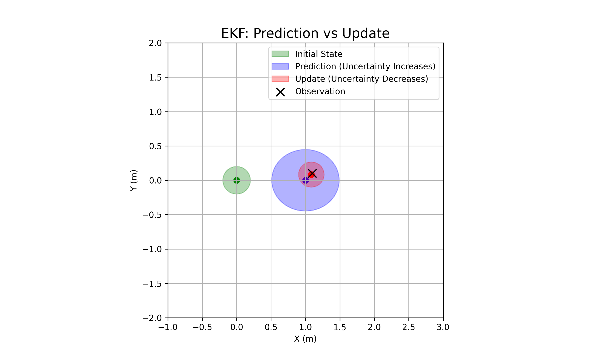

# 扩展卡尔曼滤波 (EKF) 学习笔记

> **学习日期**: 2026-02-13
> **算法类别**: 状态估计 / 定位
> **原始代码**: [extended_kalman_filter.py](../../PythonRobotics/Localization/extended_kalman_filter/extended_kalman_filter.py)
> **难度**: ⭐⭐⭐⭐

---

## 📖 算法原理：为什么要用 EKF？

在机器人世界里，**没有任何传感器是完美的**：
1.  **里程计 (Odometry)**：告诉你自己走了多远，但时间越长，误差积累越严重（漂移）。
2.  **GPS**：告诉你现在的绝对坐标，但信号不稳定，且有高斯噪声。

**卡尔曼滤波 (Kalman Filter)** 的核心思想是：**"兼听则明"**。
它结合了 **"我想象我到了哪里"（预测）** 和 **"传感器告诉我我在哪里"（观测）**，通过两者的**不确定性 (Covariance)** 加权，算出一个**最优估计值**。

### 为什么是 "Extended" (扩展)？
标准的卡尔曼滤波 (KF) 只能处理**线性系统** ($x_{k+1} = A x_k$).
但机器人的运动通常是**非线性**的（比如 $x$ 坐标的变化取决于 $\cos(\theta)$）。
EKF 通过 **泰勒展开（Taylor Expansion）** 将非线性系统在当前状态附近**线性化**（求雅可比矩阵 Jacobian），从而让 KF 能够处理非线性系统。

---

## 🔄 EKF 核心流程：预测与更新

EKF 是一个不断循环的 **"预测 ——> 纠正"** 过程：

### 第一步：🔮 预测 (Prediction)
**"闭上眼睛，根据控制指令猜我在哪"**

1.  **状态预测**：根据运动模型，推算下一时刻的位置。
    $$ \hat{x}_{k|k-1} = f(\hat{x}_{k-1}, u_k) $$
2.  **协方差预测**：随着预测，不确定性变大了（就像闭眼走路越走越虚）。
    $$ P_{k|k-1} = F_k P_{k-1} F_k^T + Q_k $$
    *   $F_k$: 运动模型及其雅可比矩阵
    *   $Q_k$: 预测过程的噪声（比如路面打滑）

### 第二步：👀 更新 (Update / Correction)
**"睁开眼睛，看路标修正位置"**

1.  **计算残差 (Innovation)**：传感器读数 $z_k$ 减去 预测的传感器读数 $h(\hat{x})$。
    $$ y_k = z_k - h(\hat{x}_{k|k-1}) $$
2.  **计算卡尔曼增益 (Kalman Gain)**：决定是更相信预测，还是更相信传感器？
    $$ S_k = H_k P_{k|k-1} H_k^T + R_k $$
    $$ K_k = P_{k|k-1} H_k^T S_k^{-1} $$
    *   $H_k$: 观测模型及其雅可比矩阵
    *   $R_k$: 传感器的噪声（由硬件决定）
3.  **状态更新**：加权修正。
    $$ \hat{x}_k = \hat{x}_{k|k-1} + K_k y_k $$
4.  **协方差更新**：确定性提高了（因为看到了路标）。
    $$ P_k = (I - K_k H_k) P_{k|k-1} $$

---

## 🔢 数学建模（基于代码）

### 1. 状态向量
$$
\mathbf{x} = \begin{bmatrix} x \\ y \\ \theta \\ v \end{bmatrix}
$$

### 2. 运动模型 (Motion Model)
代码中的 `motion_model` 函数：
$$
\begin{cases}
x_{k+1} = x_k + v_k \cos(\theta_k) \Delta t \\
y_{k+1} = y_k + v_k \sin(\theta_k) \Delta t \\
\theta_{k+1} = \theta_k + \omega_k \Delta t \\
v_{k+1} = v_k
\end{cases}
$$

**雅可比矩阵 $F$ (`jacob_f`)**：
我们需要求 $\frac{\partial f}{\partial x}$。
比如 $\frac{\partial x_{k+1}}{\partial \theta} = -v \sin(\theta) \Delta t$。

$$
F = \begin{bmatrix}
1 & 0 & -v \sin(\theta) \Delta t & \cos(\theta) \Delta t \\
0 & 1 & v \cos(\theta) \Delta t & \sin(\theta) \Delta t \\
0 & 0 & 1 & 0 \\
0 & 0 & 0 & 1
\end{bmatrix}
$$

### 3. 观测模型 (Observation Model)
代码中的 `observation_model` 函数（假设能直接观测到 $x, y$）：
$$
z = \begin{bmatrix} x \\ y \end{bmatrix} = H \mathbf{x}
$$

**雅可比矩阵 $H$ (`jacob_h`)**：
非常简单，就是从状态向量里取前两个：
$$
H = \begin{bmatrix}
1 & 0 & 0 & 0 \\
0 & 1 & 0 & 0
\end{bmatrix}
$$

---

### 4. 标准 EKF 完整流程 (main 函数解析)

代码中的 `main()` 函数构建了一个完整的仿真环境，让我们能直观看到 EKF 的效果。

#### (1) 初始化 (Line 144-155)
```python
xEst = np.zeros((4, 1))  # EKF 估计状态 [x, y, yaw, v]
xTrue = np.zeros((4, 1)) # 真实状态 (上帝视角)
PEst = np.eye(4)         # 初始协方差 (认为初始位置是准确的，但也不完全信)
xDR = np.zeros((4, 1))   # 航位推算 (Dead Reckoning) - 对比组
```
*   **xTrue**: 机器人的**真值**。在仿真里我们算出来的，用来评估算法好坏。
*   **xDR**: **瞎子乱跑**。假设没有任何传感器，只靠里程计推算。完全不进行校正，误差会越来越大。
*   **xEst**: **EKF 估计值**。结合了里程计和 GPS，是最接近真值的。

#### (2) 仿真循环 (Line 157-170)
```python
while SIM_TIME >= time:
    u = calc_input() # 1. 生成控制指令 (v=1.0, w=0.1)
    
    # 2. 生成仿真数据 (上帝视角)
    # xTrue: 真实跑了多远
    # z: GPS 观测值 (加了噪声的真实位置)
    # xDR: 瞎子推算的位置 (不加纠正)
    xTrue, z, xDR, ud = observation(xTrue, xDR, u)
    
    # 3. EKF 核心时刻！
    # 输入: 上一时刻估计值(xEst, PEst), 观测值(z), 控制指令(ud)
    # 输出: 修正后的最优估计
    xEst, PEst = ekf_estimation(xEst, PEst, z, ud)
```

#### (3) 结果对比 (Line 176-182)
*   **绿点 (z)**: GPS 观测值。你会看到它们在真实轨迹周围乱跳（因为有噪声）。
*   **蓝线 (xTrue)**: 真实轨迹。平滑的圆弧。
*   **黑线 (xDR)**: 航位推算。一开始还行，后面越跑越偏，完全飞出去了。
*   **红线 (xEst)**: EKF 估计轨迹。**紧紧咬住蓝线**，即便 GPS 乱跳，它也能过滤掉噪声，保持平滑且准确。

这展示了 EKF 的核心能力：**滤波（过滤噪声）** 和 **融合（修正偏差）**。

---

## 💻 代码实现剖析

### 核心函数：`ekf_estimation`

```python
def ekf_estimation(xEst, PEst, z, u):
    #  Predict Step
    xPred = motion_model(xEst, u)      # 1. 预测状态
    jF = jacob_f(xEst, u)              # 2. 计算运动雅可比
    PPred = jF @ PEst @ jF.T + Q       # 3. 预测协方差 (不确定性增加)

    #  Update Step
    jH = jacob_h()                     # 4. 计算观测雅可比
    zPred = observation_model(xPred)   # 5. 预测观测值
    y = z - zPred                      # 6. 计算残差 (实际 - 预测)
    S = jH @ PPred @ jH.T + R          # 7. 计算残差协方差
    K = PPred @ jH.T @ np.linalg.inv(S)# 8. 计算卡尔曼增益
    xEst = xPred + K @ y               # 9. 更正状态
    PEst = (np.eye(len(xEst)) - K @ jH) @ PPred # 10. 更正协方差 (不确定性减小)
    
    return xEst, PEst
```

### 参数含义
*   `Q`: **预测噪声协方差**。也就是我们多大程度上**不相信**自己的运动模型。
    *   越小 $\rightarrow$ 越相信模型。
*   `R`: **观测噪声协方差**。也就是我们多大程度上**不相信**传感器。
    *   越小 $\rightarrow$ 越相信传感器 (GPS)。

---

## 🎨 难点可视化：协方差椭圆



上图展示了卡尔曼滤波最核心的**"呼吸"**过程：

1.  **<span style="color:green">绿色 (初始状态)</span>**：
    *   我们在原点，有一点点不确定性（小圆圈）。
2.  **<span style="color:blue">蓝色 (预测 Prediction)</span>**：
    *   **"吸气" —— 不确定性膨胀**。
    *   机器人向右移动了 1米。由于运动模型有噪声（车轮打滑等），我们对位置的自信度下降了，所以椭圆变大了。
3.  **<span style="color:red">红色 (更新 Update)</span>**：
    *   **"呼气" —— 不确定性收缩**。
    *   我们观测到了一个地标（即便地标读数有噪声，是一个黑叉）。
    *   EKF 结合了蓝色的预测和黑色的观测，计算出了红色的最优估计。
    *   **注意**：红色的椭圆比蓝色的**更小**！这说明通过融合传感器数据，我们**更确定**自己的位置了。

这就是 EKF 的魅力：**机器人的每一次运动都会让不确定性增加，而每一次观测都会让不确定性减小。** 就像人的呼吸一样，周而复始。

---

## ❓ 答疑：为什么 H 矩阵长这样？

### 1. 为什么能直接观测到 x, y？

在代码里，我们假设机器人装了一个 **GPS**。
*   GPS 直接告诉我们：我现在大概在 $(x_{gps}, y_{gps})$。
*   所以我们的观测方程 $z = h(x)$ 很简单，就是直接把状态向量里的前两个数拿出来。

**注意**：如果装的是**激光雷达**，观测到的可能是 $(距离 r, 角度 \phi)$，那时候 $h(x)$ 就变复杂了（需要三角函数变换），$H$ 矩阵也会变得很复杂。

### 2. H 矩阵是怎么推导出来的？（横着取还是竖着取？）

**不要死记硬背！看维度！**

*   **状态向量 $\mathbf{x}$** ($4 \times 1$)：
    $$ \mathbf{x} = \begin{bmatrix} x \\ y \\ \theta \\ v \end{bmatrix} $$
*   **观测向量 $\mathbf{z}$** ($2 \times 1$)：
    $$ \mathbf{z} = \begin{bmatrix} z_1 \\ z_2 \end{bmatrix} = \begin{bmatrix} x_{gps} \\ y_{gps} \end{bmatrix} $$

我们想要用一个矩阵 $H$ 去乘以 $\mathbf{x}$ 得到 $\mathbf{z}$：
$$ \mathbf{z} = H \mathbf{x} $$
$$ [2 \times 1] = [2 \times 4] \times [4 \times 1] $$

所以 $H$ 必须是一个 **2行 4列** 的矩阵。

**每一行代表一个观测值的来源**：
*   **第1行 (观测 $x$)**：我们要选出状态里的第1个元素。
    $$ [1, 0, 0, 0] \times [x, y, \theta, v]^T = 1\cdot x + 0\cdot y + 0\cdot \theta + 0\cdot v = x $$
*   **第2行 (观测 $y$)**：我们要选出状态里的第2个元素。
    $$ [0, 1, 0, 0] \times [x, y, \theta, v]^T = 0\cdot x + 1\cdot y + 0\cdot \theta + 0\cdot v = y $$

**合起来就是**：
$$
H = \begin{bmatrix}
1 & 0 & 0 & 0 \\
0 & 1 & 0 & 0
\end{bmatrix}
$$

**总结**：每一行像一个**筛子**，把我们需要的那一维状态“筛”出来。因为我们要筛两个值 ($x$ 和 $y$)，所以有两行。

### 3. 举一反三：如果我们还能观测到角度 $\theta$ 呢？

**是的，H 矩阵绝对会变！**

假如你的机器人不仅有 GPS (x, y)，还装了一个 **电子罗盘 (Compass)**，能直接测量车头的朝向 $\theta$。

**现在的观测向量 $\mathbf{z}$ 变成了 3 维**：
$$ \mathbf{z} = \begin{bmatrix} x_{gps} \\ y_{gps} \\ \theta_{compass} \end{bmatrix} $$

**H 矩阵就会变成 $3 \times 4$**：
我们不仅要筛出 $x, y$，还要筛出状态向量 $[x, y, \theta, v]$ 中的第3个元素 $\theta$。

$$
H = \begin{bmatrix}
1 & 0 & 0 & 0 \\
0 & 1 & 0 & 0 \\
0 & 0 & 1 & 0
\end{bmatrix} \leftarrow \text{新增加的一行，负责“筛”出 } \theta
$$

**结论**：
*   **H 的列数** = 状态向量的维度（你总共有几个状态？）
*   H 里的 `1` 和 `0` 就是在画连线题，把观测值和状态值连起来。

### 4. 什么是协方差 (Covariance)？它的作用是什么？

**一句话解释：协方差就是“不确定性” (Uncertainty)。**

在 EKF 中，协方差矩阵 $P$ 并不代表机器人的位置，而是代表机器人**对自己位置的“自信程度”**。

#### (1) 直观理解：
*   **$P$ 很小**：我觉得我极其准确，几乎没有误差。（像是一个很小的点）
*   **$P$ 很大**：我其实不知道我在哪，可能在这里，也可能在那里。（像是一个巨大的光斑）

#### (2) 作用：决定“听谁的”
卡尔曼滤波的核心就是：**加权平均**。权重的来源就是协方差。

$$ K_k = \frac{P_{predict}}{P_{predict} + R_{sensor}} $$
*(注：这是简化的一维公式，方便理解)*

*   **如果 $P_{predict}$ 很大**（预测不准）：
    *   $K_k \approx 1$。
    *   结果会**倒向传感器**。因为我自己太虚了，所以我全听传感器的。
*   **如果 $P_{predict}$ 很小**（预测很准）**或者 $R_{sensor}$ 很大**（传感器很烂）：
    *   $K_k \approx 0$。
    *   结果会**倒向预测**。因为传感器是垃圾，我宁愿相信我自己的推算。

**总结**：协方差 $P$ 就是 EKF 算法里的**“信用评分系统”**。它自动调节预测和观测的权重，谁更靠谱，就更相信谁。
