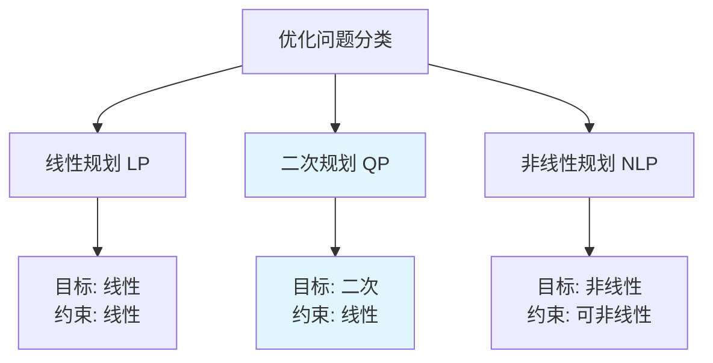
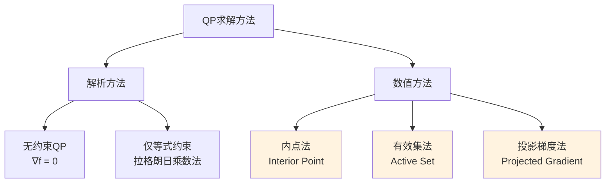

# 二次规划（QP）求解基础：从理论到实践

> **作者**：学习笔记
> **日期**：2026-03-09
> **主题**：二次规划理论、求解方法与MPC应用

---

## 📚 目录

1. [什么是二次规划](#1-什么是二次规划)
2. [QP问题的标准形式](#2-qp问题的标准形式)
3. [求解方法](#3-求解方法)
4. [在MPC中的应用](#4-在mpc中的应用)
5. [Python实现](#5-python实现)

---

## 1. 什么是二次规划

### 1.1 问题定义

**二次规划（Quadratic Programming, QP）** 是一类数学优化问题：
- **目标函数**：二次函数（凸的）
- **约束条件**：线性不等式和等式

### 1.2 为什么重要？

在控制理论中，QP广泛出现在：
- **模型预测控制（MPC）**：每个时间步求解一个QP问题
- **有约束LQR**：带约束的线性二次调节器
- **轨迹优化**：路径规划和运动控制

### 1.3 与其他优化问题的关系



**特点**：QP结合了LP的约束简单性和NLP的目标函数表达能力

---

## 2. QP问题的标准形式

### 2.1 一般形式

$$\begin{align}
\min_{\mathbf{x}} \quad & \frac{1}{2} \mathbf{x}^T \mathbf{H} \mathbf{x} + \mathbf{f}^T \mathbf{x} \\
\text{s.t.} \quad & \mathbf{A} \mathbf{x} = \mathbf{b} \quad \text{(等式约束)} \\
& \mathbf{C} \mathbf{x} \leq \mathbf{d} \quad \text{(不等式约束)} \\
& \mathbf{x}_{\text{min}} \leq \mathbf{x} \leq \mathbf{x}_{\text{max}} \quad \text{(边界约束)}
\end{align}$$

### 2.2 参数说明

| 符号 | 含义 | 维度 |
|------|------|------|
| $\mathbf{x}$ | 决策变量向量 | $n \times 1$ |
| $\mathbf{H}$ | Hessian矩阵（必须半正定） | $n \times n$ |
| $\mathbf{f}$ | 线性项系数 | $n \times 1$ |
| $\mathbf{A}$ | 等式约束矩阵 | $m_e \times n$ |
| $\mathbf{b}$ | 等式约束右端 | $m_e \times 1$ |
| $\mathbf{C}$ | 不等式约束矩阵 | $m_i \times n$ |
| $\mathbf{d}$ | 不等式约束右端 | $m_i \times 1$ |

### 2.3 凸性要求

**关键条件**：$\mathbf{H} \succeq 0$ （半正定）

**为什么重要？**
- 保证目标函数是凸的
- 保证存在全局最优解
- 保证KKT条件是最优性的充分条件

### 2.4 简化形式

**仅不等式约束**：
$$\begin{align}
\min_{\mathbf{x}} \quad & \frac{1}{2} \mathbf{x}^T \mathbf{H} \mathbf{x} + \mathbf{f}^T \mathbf{x} \\
\text{s.t.} \quad & \mathbf{C} \mathbf{x} \leq \mathbf{d}
\end{align}$$

**仅等式约束**：
$$\begin{align}
\min_{\mathbf{x}} \quad & \frac{1}{2} \mathbf{x}^T \mathbf{H} \mathbf{x} + \mathbf{f}^T \mathbf{x} \\
\text{s.t.} \quad & \mathbf{A} \mathbf{x} = \mathbf{b}
\end{align}$$

---

## 3. 求解方法

### 3.1 方法分类



### 3.2 无约束QP的解析解

**问题**：
$$\min_{\mathbf{x}} \frac{1}{2} \mathbf{x}^T \mathbf{H} \mathbf{x} + \mathbf{f}^T \mathbf{x}$$

**解法**：
1. 求梯度：$\nabla f = \mathbf{H} \mathbf{x} + \mathbf{f} = 0$
2. 解方程：$\mathbf{x}^* = -\mathbf{H}^{-1} \mathbf{f}$

**条件**：$\mathbf{H} \succ 0$ （正定，可逆）

### 3.3 等式约束QP的解析解

**问题**：
$$\begin{align}
\min_{\mathbf{x}} \quad & \frac{1}{2} \mathbf{x}^T \mathbf{H} \mathbf{x} + \mathbf{f}^T \mathbf{x} \\
\text{s.t.} \quad & \mathbf{A} \mathbf{x} = \mathbf{b}
\end{align}$$

**拉格朗日函数**：
$$\mathcal{L}(\mathbf{x}, \boldsymbol{\lambda}) = \frac{1}{2} \mathbf{x}^T \mathbf{H} \mathbf{x} + \mathbf{f}^T \mathbf{x} + \boldsymbol{\lambda}^T (\mathbf{A} \mathbf{x} - \mathbf{b})$$

**KKT条件**：
$$\begin{bmatrix}
\mathbf{H} & \mathbf{A}^T \\
\mathbf{A} & 0
\end{bmatrix}
\begin{bmatrix}
\mathbf{x}^* \\
\boldsymbol{\lambda}^*
\end{bmatrix}
=
\begin{bmatrix}
-\mathbf{f} \\
\mathbf{b}
\end{bmatrix}$$

### 3.4 内点法（Interior Point Method）

**核心思想**：通过障碍函数将不等式约束"软化"

**算法步骤**：
1. **障碍问题**：
   $$\min_{\mathbf{x}} \frac{1}{2} \mathbf{x}^T \mathbf{H} \mathbf{x} + \mathbf{f}^T \mathbf{x} - \mu \sum_i \log(d_i - \mathbf{c}_i^T \mathbf{x})$$

2. **路径跟踪**：逐渐减小 $\mu$ 直到收敛

3. **牛顿方向**：在每个 $\mu$ 下求解修正的KKT系统

**优点**：
- 收敛速度快（超线性）
- 适合大规模问题
- 现代QP求解器的主流方法

### 3.5 有效集法（Active Set Method）

**核心思想**：维护一个"有效约束"集合，在子空间内求解

**算法步骤**：
1. **初始化**：找到一个可行点和初始有效集
2. **子问题求解**：在当前有效约束张成的子空间内求解
3. **约束管理**：
   - 如果解违反不活跃约束 → 添加约束
   - 如果拉格朗日乘数为负 → 删除约束
4. **迭代**：重复直到收敛

**优点**：
- 直观易懂
- 适合中小规模问题
- 能精确识别有效约束

---

## 4. 在MPC中的应用

### 4.1 MPC的QP形式

**离散时间系统**：
$$\mathbf{x}[k+1] = \mathbf{A} \mathbf{x}[k] + \mathbf{B} \mathbf{u}[k]$$

**MPC优化问题**：
$$\begin{align}
\min_{\{\mathbf{u}[k]\}} \quad & \sum_{i=0}^{N-1} \left( \|\mathbf{x}[k+i] - \mathbf{x}_{\text{ref}}\|_{\mathbf{Q}}^2 + \|\mathbf{u}[k+i]\|_{\mathbf{R}}^2 \right) + \|\mathbf{x}[k+N] - \mathbf{x}_{\text{ref}}\|_{\mathbf{Q}_f}^2 \\
\text{s.t.} \quad & \mathbf{x}[k+i+1] = \mathbf{A} \mathbf{x}[k+i] + \mathbf{B} \mathbf{u}[k+i] \\
& \mathbf{u}_{\min} \leq \mathbf{u}[k+i] \leq \mathbf{u}_{\max} \\
& \mathbf{x}_{\min} \leq \mathbf{x}[k+i] \leq \mathbf{x}_{\max}
\end{align}$$

### 4.2 转换为标准QP形式

**决策变量**：
$$\mathbf{z} = \begin{bmatrix} \mathbf{u}[k] \\ \mathbf{u}[k+1] \\ \vdots \\ \mathbf{u}[k+N-1] \end{bmatrix}$$

**目标函数矩阵形式**：
$$J = \frac{1}{2} \mathbf{z}^T \mathbf{H} \mathbf{z} + \mathbf{f}^T \mathbf{z} + \text{const}$$

其中：
- $\mathbf{H}$ 包含 $\mathbf{Q}$、$\mathbf{R}$ 和系统矩阵的组合
- $\mathbf{f}$ 包含参考轨迹和当前状态的信息

### 4.3 约束矩阵构造

**控制约束**：
$$\mathbf{C}_u \mathbf{z} \leq \mathbf{d}_u$$

**状态约束**（通过预测模型）：
$$\mathbf{C}_x \mathbf{z} \leq \mathbf{d}_x - \mathbf{C}_{x0} \mathbf{x}[k]$$

### 4.4 实时性考虑

**挑战**：
- MPC需要在每个控制周期求解一个QP
- 求解时间必须小于采样时间

**解决方案**：
1. **热启动**：利用上一步的解作为初值
2. **模型简化**：降低预测时域或状态维度
3. **专用求解器**：如qpOASES、OSQP等
4. **近似方法**：显式MPC、快速梯度法等

---

## 5. Python实现

### 5.1 使用CVXPY求解QP

```python
import cvxpy as cp
import numpy as np

def solve_qp_cvxpy(H, f, A=None, b=None, C=None, d=None,
                   x_min=None, x_max=None):
    """
    使用CVXPY求解二次规划问题

    min  1/2 x^T H x + f^T x
    s.t. A x = b          (等式约束)
         C x <= d         (不等式约束)
         x_min <= x <= x_max (边界约束)
    """
    n = H.shape[0]
    x = cp.Variable(n)

    # 目标函数
    objective = cp.Minimize(0.5 * cp.quad_form(x, H) + f.T @ x)

    # 约束条件
    constraints = []

    if A is not None and b is not None:
        constraints.append(A @ x == b)

    if C is not None and d is not None:
        constraints.append(C @ x <= d)

    if x_min is not None:
        constraints.append(x >= x_min)

    if x_max is not None:
        constraints.append(x <= x_max)

    # 求解问题
    problem = cp.Problem(objective, constraints)
    problem.solve()

    if problem.status == cp.OPTIMAL:
        return x.value, problem.value
    else:
        raise RuntimeError(f"求解失败: {problem.status}")

# 示例使用
if __name__ == "__main__":
    # 定义一个简单的QP问题
    # min  x1^2 + x2^2 - 2*x1 - 4*x2
    # s.t. x1 + x2 <= 3
    #      x1, x2 >= 0

    H = np.array([[2.0, 0.0],
                  [0.0, 2.0]])
    f = np.array([-2.0, -4.0])

    # 不等式约束: x1 + x2 <= 3
    C = np.array([[1.0, 1.0]])
    d = np.array([3.0])

    # 边界约束: x >= 0
    x_min = np.array([0.0, 0.0])

    x_opt, f_opt = solve_qp_cvxpy(H, f, C=C, d=d, x_min=x_min)

    print(f"最优解: x* = {x_opt}")
    print(f"最优值: f* = {f_opt}")
```

### 5.2 使用scipy.optimize求解

```python
from scipy.optimize import minimize
import numpy as np

def solve_qp_scipy(H, f, A=None, b=None, C=None, d=None,
                   bounds=None):
    """
    使用scipy求解二次规划问题
    """

    def objective(x):
        return 0.5 * x.T @ H @ x + f.T @ x

    def gradient(x):
        return H @ x + f

    # 约束条件
    constraints = []

    if A is not None and b is not None:
        # 等式约束
        constraints.append({
            'type': 'eq',
            'fun': lambda x: A @ x - b,
            'jac': lambda x: A
        })

    if C is not None and d is not None:
        # 不等式约束
        constraints.append({
            'type': 'ineq',
            'fun': lambda x: d - C @ x,
            'jac': lambda x: -C
        })

    # 初始点
    x0 = np.zeros(H.shape[0])

    # 求解
    result = minimize(
        fun=objective,
        jac=gradient,
        x0=x0,
        method='SLSQP',
        constraints=constraints,
        bounds=bounds,
        options={'disp': True}
    )

    return result.x, result.fun

# 示例：同上面的问题
H = np.array([[2.0, 0.0], [0.0, 2.0]])
f = np.array([-2.0, -4.0])
C = np.array([[1.0, 1.0]])
d = np.array([3.0])
bounds = [(0, None), (0, None)]  # x >= 0

x_opt, f_opt = solve_qp_scipy(H, f, C=C, d=d, bounds=bounds)
print(f"最优解: x* = {x_opt}")
print(f"最优值: f* = {f_opt}")
```

### 5.3 专业QP求解器

```python
# 使用OSQP求解器（高效，适合MPC）
import osqp
import scipy.sparse as sp

def solve_qp_osqp(H, f, A=None, b=None, C=None, d=None,
                  x_min=None, x_max=None):
    """
    使用OSQP求解二次规划问题
    """
    n = H.shape[0]

    # 构造约束矩阵
    constraints_A = []
    constraints_l = []
    constraints_u = []

    # 等式约束
    if A is not None and b is not None:
        constraints_A.append(A)
        constraints_l.extend(b)
        constraints_u.extend(b)

    # 不等式约束
    if C is not None and d is not None:
        constraints_A.append(C)
        constraints_l.extend([-np.inf] * len(d))
        constraints_u.extend(d)

    # 边界约束
    if x_min is not None or x_max is not None:
        I = sp.eye(n)
        constraints_A.append(I)
        constraints_l.extend(x_min if x_min is not None else [-np.inf] * n)
        constraints_u.extend(x_max if x_max is not None else [np.inf] * n)

    # 合并约束
    if constraints_A:
        A_combined = sp.vstack(constraints_A)
        l_combined = np.array(constraints_l)
        u_combined = np.array(constraints_u)
    else:
        A_combined = None
        l_combined = None
        u_combined = None

    # 创建求解器
    prob = osqp.OSQP()
    prob.setup(
        P=sp.csc_matrix(H),
        q=f,
        A=A_combined,
        l=l_combined,
        u=u_combined,
        verbose=False
    )

    # 求解
    result = prob.solve()

    if result.info.status == 'solved':
        return result.x, result.info.obj_val
    else:
        raise RuntimeError(f"求解失败: {result.info.status}")
```

### 5.4 MPC中的QP求解示例

```python
def mpc_qp_formulation(A, B, Q, R, N, x0, x_ref, u_min, u_max):
    """
    构造MPC的QP问题
    """
    n_x, n_u = B.shape

    # 预测矩阵
    Phi = np.zeros((N * n_x, n_x))
    Gamma = np.zeros((N * n_x, N * n_u))

    for i in range(N):
        # 状态预测矩阵
        Phi[i*n_x:(i+1)*n_x, :] = np.linalg.matrix_power(A, i+1)

        # 控制预测矩阵
        for j in range(i+1):
            Gamma[i*n_x:(i+1)*n_x, j*n_u:(j+1)*n_u] = \
                np.linalg.matrix_power(A, i-j) @ B

    # 目标函数权重矩阵
    Q_bar = sp.block_diag([Q] * N)
    R_bar = sp.block_diag([R] * N)

    # QP矩阵
    H = Gamma.T @ Q_bar @ Gamma + R_bar
    f = Gamma.T @ Q_bar @ (Phi @ x0 - np.tile(x_ref, N))

    # 控制约束
    C = np.vstack([np.eye(N * n_u), -np.eye(N * n_u)])
    d = np.concatenate([
        np.tile(u_max, N),  # u <= u_max
        np.tile(-u_min, N)  # -u >= -u_min, i.e., u >= u_min
    ])

    return H, f, C, d

# 使用示例
# ... (定义系统矩阵、权重等)
# H, f, C, d = mpc_qp_formulation(A, B, Q, R, N, x0, x_ref, u_min, u_max)
# u_opt, _ = solve_qp_osqp(H, f, C=C, d=d)
```

---

## 💡 核心要点总结

### QP的重要特性

1. **凸优化**：目标函数二次，约束线性 → 凸问题
2. **全局最优**：凸性保证局部最优即全局最优
3. **KKT条件**：最优性的充要条件
4. **多项式复杂度**：内点法具有多项式时间复杂度

### 求解器选择指南

| 场景 | 推荐求解器 | 理由 |
|------|------------|------|
| **原型开发** | CVXPY | 语法简洁，易于调试 |
| **教学研究** | scipy.optimize | 理解算法原理 |
| **实时MPC** | OSQP, qpOASES | 高效，支持热启动 |
| **大规模问题** | Gurobi, MOSEK | 商业求解器，性能最佳 |

### 与LQR的关系

- **无约束QP** = **LQR问题**：解析解存在
- **有约束QP** = **约束LQR/MPC**：需要数值求解
- **ARE求解** 本质上是无约束QP的特殊情况

QP是现代控制理论中连接理论与实践的重要桥梁！