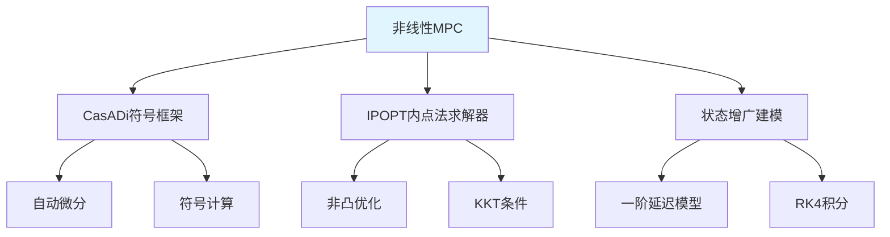

# 非线性MPC实现原理与CasADi应用

> **作者**：学习笔记
> **日期**：2026-03-10
> **主题**：非线性MPC的直接优化方法与工程实现

---

## 📚 目录

1. [非线性MPC vs 线性化MPC](#1-非线性mpc-vs-线性化mpc)
2. [阿卡曼转向模型增强](#2-阿卡曼转向模型增强)
3. [CasADi符号优化框架](#3-casadi符号优化框架)
4. [非凸优化问题分析](#4-非凸优化问题分析)
5. [IPOPT求解器原理](#5-ipopt求解器原理)
6. [工程实现的关键技术](#6-工程实现的关键技术)

---

## 1. 非线性MPC vs 线性化MPC

### 1.1 根本性差异

| 特征 | 线性化MPC | 非线性MPC |
|------|-----------|-----------|
| **建模方式** | 非线性系统 → Taylor展开线性化 | 直接使用非线性模型 |
| **优化问题** | QP (Quadratic Programming) | NLP (Nonlinear Programming) |
| **求解器** | QP求解器 (如OSQP) | NLP求解器 (如IPOPT) |
| **计算复杂度** | 低 (凸优化) | 高 (非凸优化) |
| **精度** | 近似 (线性化误差) | 精确建模 |

### 1.2 线性化MPC的局限

**PythonRobotics方法的问题**：
```python
# 需要在每个预测点进行线性化
for t in range(N):
    A[t], B[t], C[t] = linearize_at_point(x_trajectory[t], u_sequence[t])
    # 计算雅可比矩阵，引入线性化误差
```

**线性化误差源**：
1. **Taylor展开截断误差**：忽略二阶及高阶项
2. **线性化点依赖**：远离线性化点时精度下降
3. **迭代不一致性**：线性化系数与实际最优轨迹不匹配

### 1.3 非线性MPC的优势

```cpp
// 直接使用非线性运动学方程
MX rhs = MX::vertcat({
    v*cos(theta),                    // 精确的非线性关系
    v*sin(theta),
    v*tan(delta),
    -delta/config_.tao + segma/config_.tao
});
```

**核心优势**：
- ✅ **零线性化误差**：直接优化非线性系统
- ✅ **模型精确性**：完整保留系统非线性特性
- ✅ **实现简洁**：无需计算雅可比矩阵

---

## 2. 阿卡曼转向模型增强

### 2.1 传统阿卡曼模型问题

**标准阿卡曼模型**：
```
状态: [x, y, θ]
控制: [v, δ] (速度, 前轮转角)

dx/dt = v*cos(θ)
dy/dt = v*sin(θ)
dθ/dt = v*tan(δ)/L
```

**问题**：前轮转角δ是控制输入，存在**纯延迟**和**执行器动态**。

### 2.2 状态增广策略

**C++实现的创新**：
```cpp
// 将前轮转角δ作为状态变量
MX x = MX::sym("x");
MX y = MX::sym("y");
MX theta = MX::sym("theta");
MX delta = MX::sym("delta");     // 关键：δ变为状态

// 控制输入变为转角指令
MX v = MX::sym("v");
MX segma = MX::sym("segma");     // 转角控制指令
```

**增广后的系统**：
```
状态: [x, y, θ, δ]  (4维)
控制: [v, σ]       (2维)

dx/dt = v*cos(θ)
dy/dt = v*sin(θ)
dθ/dt = v*tan(δ)
dδ/dt = -δ/τ + σ/τ    // 一阶延迟模型
```

### 2.3 一阶延迟模型意义

**数学表达**：
$$\frac{d\delta}{dt} = -\frac{\delta}{\tau} + \frac{\sigma}{\tau}$$

**物理意义**：
- **τ**：执行器时间常数
- **σ**：转角指令 (新的控制输入)
- **δ**：实际前轮转角 (现在是状态)

**优势**：
1. **消除纯延迟**：避免数值求解困难
2. **建模执行器动态**：更接近真实系统
3. **便于约束处理**：δ作为状态可直接约束

### 2.4 约束设计

```cpp
// 前轮转角约束 (状态约束)
for (int i = 0; i < config_.N+1; ++i) {
    lbx[dimension * i + 3] = -config_.max_delta;
    ubx[dimension * i + 3] = config_.max_delta;
}

// 转角指令约束 (控制约束)
for (int i = 0; i < config_.N; ++i) {
    lbx[dimension * (config_.N + 1) + 2 * i + 1] = -config_.max_segma;
    ubx[dimension * (config_.N + 1) + 2 * i + 1] = config_.max_segma;
}
```

---

## 3. CasADi符号优化框架

### 3.1 CasADi核心概念

**CasADi**是一个用于**非线性优化**和**算法微分**的开源工具：

```cpp
using namespace casadi;

// 符号变量定义
MX x = MX::sym("x");                    // 符号标量
MX state = MX::vertcat({x, y, theta, delta}); // 符号向量

// 符号函数定义
MX rhs = MX::vertcat({v*cos(theta), v*sin(theta),
                      v*tan(delta), -delta/tao + segma/tao});
Function f = Function("f", {state, controls}, {rhs});
```

### 3.2 自动微分能力

**关键特性**：CasADi能够**自动计算**复杂表达式的导数

```cpp
// 复杂的非线性表达式
MX theta_diff = st_next(2) - ref(2);
MX theta_diff_wrapped = atan2(sin(theta_diff), cos(theta_diff));
obj += config_.Q_theta * pow(theta_diff_wrapped, 2);

// CasADi自动计算:
// ∂obj/∂u, ∂²obj/∂u², ∂g/∂u 等
```

**手工计算的复杂性**：
- `atan2(sin(θ), cos(θ))` 的导数涉及复杂的链式法则
- RK4积分的导数需要多重嵌套微分
- 人工推导极易出错且工作量巨大

### 3.3 符号 vs 数值方法对比

| 方法 | 优点 | 缺点 |
|------|------|------|
| **数值微分** | 实现简单 | 精度差、数值误差大 |
| **手工推导** | 精度高 | 推导复杂、易错 |
| **CasADi自动微分** | 精度高、自动化 | 需要学习新框架 |

### 3.4 优化问题构造

```cpp
// 创建优化问题的符号表达
MXDict nlp = {
    {"x", MX::vertcat({MX::reshape(X, dimension*(config_.N+1), 1),    // 决策变量
                       MX::reshape(U, 2*config_.N, 1)})},
    {"f", obj},                                                        // 目标函数
    {"g", g},                                                         // 约束函数
    {"p", MX::vertcat({X0, MX::reshape(Xref, dimension*(config_.N+1), 1)})} // 参数
};

// 创建求解器
solver = nlpsol("solver", "ipopt", nlp, opts);
```

---

## 4. 非凸优化问题分析

### 4.1 为什么是非凸的？

**非凸性来源**：

1. **三角函数约束**：
   ```cpp
   v*cos(theta)  // cos函数在全域非凸
   v*sin(theta)  // sin函数在全域非凸
   v*tan(delta)  // tan函数在全域非凸
   ```

2. **角度归一化**：
   ```cpp
   MX theta_diff_wrapped = atan2(sin(theta_diff), cos(theta_diff));
   ```
   `atan2`函数是非凸的

3. **RK4积分约束**：
   ```cpp
   MX k1 = f({st, con})[0];
   MX k2 = f({st + config_.dt/2 * k1, con})[0];
   // 复杂的非线性递归关系
   ```

### 4.2 非凸性的数学分析

**凸函数定义**：函数f是凸的当且仅当对于任意x₁, x₂和λ ∈ [0,1]：
$$f(\lambda x_1 + (1-\lambda) x_2) \leq \lambda f(x_1) + (1-\lambda) f(x_2)$$

**反例验证**：对于 `f(θ) = cos(θ)`
- 取 `θ₁ = 0, θ₂ = π, λ = 0.5`
- `f(0.5×0 + 0.5×π) = f(π/2) = cos(π/2) = 0`
- `0.5×f(0) + 0.5×f(π) = 0.5×1 + 0.5×(-1) = 0`
- 虽然这里相等，但在其他点上不满足凸性条件

### 4.3 局部凸性分析

尽管全局非凸，在**小邻域**内可能表现出凸特性：

**条件**：
1. **小角度变化**：`|Δθ| << π/2` 时，`cos(θ) ≈ 1`, `sin(θ) ≈ θ`
2. **平滑轨迹**：车辆运动相对平滑，状态变化连续
3. **良好初值**：MPC的滚动特性提供好的初始猜测

**实际意义**：虽然理论上非凸，但在MPC的具体应用场景下，问题展现出"近似凸性"。

---

## 5. IPOPT求解器原理

### 5.1 IPOPT简介

**IPOPT** (Interior Point OPTimizer) 是专门求解大规模**非线性优化**问题的求解器：

```cpp
Dict opts;
opts["ipopt.print_level"] = 0;    // 关闭输出
opts["print_time"] = 0;
solver = nlpsol("solver", "ipopt", nlp, opts);
```

### 5.2 内点法核心思想

**原优化问题**：
```
minimize   f(x)
subject to g(x) = 0      (等式约束)
           h(x) ≤ 0      (不等式约束)
           xl ≤ x ≤ xu   (边界约束)
```

**内点法转换**：将不等式约束用**障碍函数**处理
```
minimize   f(x) - μ Σ ln(s_i)
subject to g(x) = 0
           h(x) + s = 0
           s > 0
```

其中：
- **μ**：障碍参数 (逐渐减小到0)
- **s**：松弛变量
- **ln(s)**：对数障碍函数

### 5.3 IPOPT的优势

1. **处理非凸问题**：
   - 不保证全局最优，但能找到高质量局部最优解
   - 对初值敏感，但MPC提供了良好的热启动

2. **稀疏矩阵利用**：
   - MPC问题具有天然的稀疏结构
   - IPOPT高效利用稀疏性

3. **梯度信息**：
   - 需要目标函数和约束的一阶、二阶导数
   - CasADi自动提供精确的梯度信息

### 5.4 收敛性保证

**理论保证**：
- 在适当的正则性条件下，IPOPT收敛到**KKT点**
- KKT点是局部最优的必要条件

**实际表现**：
- MPC的滚动特性提供了优秀的初值
- 上一时刻的最优解作为下一时刻的初值 (热启动)
- 通常在几次迭代内快速收敛

---

## 6. 工程实现的关键技术

### 6.1 RK4积分方法

#### 6.1.1 基本概念与原理

**Runge-Kutta 4阶方法**是求解常微分方程的经典数值积分算法：

**问题定义**：给定微分方程 `dx/dt = f(x, t)`，已知初值 `x(t₀) = x₀`，求 `x(t₀ + h)`

**挑战**：我们只知道瞬时变化率`f(x,t)`，如何准确预测有限步长后的状态？

#### 6.1.2 从简单到复杂的积分方法

**1. 欧拉法**（最简单，但不准确）：
```
x[k+1] = x[k] + h * f(x[k], t[k])
```
**问题**：只用起始点的斜率，误差大

**2. 中点法**（改进）：
```
k1 = h * f(x[k], t[k])
x[k+1] = x[k] + h * f(x[k] + k1/2, t[k] + h/2)
```
**改进**：用中点斜率，更准确

**3. RK4**（经典4阶方法）：
```cpp
k1 = h * f(x[k], t[k])                    // 起始点斜率
k2 = h * f(x[k] + k1/2, t[k] + h/2)      // 中点斜率1
k3 = h * f(x[k] + k2/2, t[k] + h/2)      // 中点斜率2
k4 = h * f(x[k] + k3, t[k] + h)          // 终点斜率

x[k+1] = x[k] + (k1 + 2*k2 + 2*k3 + k4)/6
```

#### 6.1.3 几何直观理解

想象您要从山坡上的A点走到B点：

1. **k1**：在A点看坡度，决定初始方向
2. **k2**：走到中途，重新看坡度，调整方向
3. **k3**：用新方向再走中途，再次调整
4. **k4**：用最新方向走到终点，最后调整

**最终路径**：综合4次"试探"，得到最优路径

#### 6.1.4 代码中的f(x)函数

在我们的阿卡曼MPC实现中，**f(x)函数**定义在第22行：

```cpp
Function f = Function("f", {state, controls}, {rhs});
```

**输入参数**：
- **state**：状态向量 `[x, y, theta, delta]`（4维）
- **controls**：控制向量 `[v, segma]`（2维）

**输出rhs**（右手边，即导数）：
```cpp
MX rhs = MX::vertcat({
    v*cos(theta),           // dx/dt
    v*sin(theta),           // dy/dt
    v*tan(delta),           // dtheta/dt
    -delta/config_.tao + segma/config_.tao  // ddelta/dt
});
```

#### 6.1.5 RK4的具体调用过程

在**第43-46行**：

```cpp
// k1: 使用当前状态和控制
MX k1 = f(std::vector<MX>{st, con})[0];

// k2: 使用中间状态 (st + dt/2 * k1) 和同样控制
MX k2 = f(std::vector<MX>{st + config_.dt/2 * k1, con})[0];

// k3: 使用中间状态 (st + dt/2 * k2) 和同样控制
MX k3 = f(std::vector<MX>{st + config_.dt/2 * k2, con})[0];

// k4: 使用终点状态 (st + dt * k3) 和同样控制
MX k4 = f(std::vector<MX>{st + config_.dt * k3, con})[0];
```

**关键问题解答**：

**Q1: 为什么控制量con在所有4次调用中保持不变？**
**A1**: 控制量在时间步dt内被假设为**分段常数**。这是MPC的标准假设，控制指令在预测步长内保持恒定。

**Q2: 为什么中间状态可以用st + dt/2 * k1表示？**
**A2**: 这来自**泰勒展开**的一阶近似：
```
x(t + h/2) ≈ x(t) + (h/2)*x'(t)
其中：x(t) = st，x'(t) = k1，h/2 = dt/2
所以：中间状态 ≈ st + dt/2 * k1
```

这不是精确值，而是**估算值**，但RK4通过多次修正和加权平均来补偿误差。

#### 6.1.6 误差分析与鲁棒性

**误差来源**：
1. **控制量假设**：在dt内假设控制为常数
2. **中间状态估算**：使用一阶近似计算中间点

**RK4的鲁棒性**：
- **误差自我修正**：每一步都在修正前一步的误差
- **高阶精度**：通过加权平均，低阶误差项（h²、h³、h⁴）精确抵消
- **系数(1,2,2,1)/6**：来自辛普森积分规则，最优化地组合4个斜率

**局部截断误差**：
- **欧拉法**：O(h²)
- **RK4**：O(h⁵)

当步长减半时：
- 欧拉法误差减少4倍
- RK4误差减少32倍！

#### 6.1.7 在MPC中的工程价值

这种高精度积分让MPC能够：

1. **使用较大步长**：不用担心数值不稳定
2. **预测更远时域**：误差不会快速累积
3. **处理强非线性**：在强非线性区域仍然稳定

**精度对比**：
- **欧拉方法**：O(dt) 精度
- **RK4方法**：O(dt⁴) 精度

### 6.2 角度处理技术

**问题**：角度具有周期性，θ和θ+2π表示相同方向

**解决方案**：角度归一化
```cpp
MX angle_diff = st_next(2) - st_next_rk4(2);
MX angle_diff_wrapped = atan2(sin(angle_diff), cos(angle_diff));
g = MX::vertcat({g, angle_diff_wrapped});
```

**数学原理**：
- `atan2(sin(Δθ), cos(Δθ))` 将角度差映射到 `[-π, π]`
- 避免角度跳跃导致的数值问题

### 6.3 热启动策略

```cpp
// 使用上一时刻的解作为初始猜测
std::vector<double> x0(dimension * (config_.N + 1) + 2 * config_.N, 0);

DMDict arg = {
    {"x0", x0},          // 初始猜测
    {"p", DM::vertcat({DM(X0), DM(Xref)})}  // 当前状态和参考轨迹
};
```

**热启动优势**：
1. **加速收敛**：从接近最优的点开始迭代
2. **数值稳定**：避免初值选择不当导致的发散
3. **实时性保证**：减少求解时间

### 6.4 目标函数设计

**多目标平衡**：
```cpp
// 跟踪误差
obj += config_.Q_x * pow(st_next(0) - ref(0), 2);
obj += config_.Q_y * pow(st_next(1) - ref(1), 2);

// 控制代价
obj += config_.R_v * pow(con(0), 2);
obj += config_.R_segma * pow(con(1), 2);

// 平滑性约束
obj += config_.W_vel_diff * pow(con(0) - U(Slice(), k-1)(0), 2);

// 终端代价
if (k == config_.N-1) {
    obj += config_.W_terminal_x * pow(st_next(0) - ref(0), 2);
}
```

**权重调节策略**：
- **Q权重**：跟踪精度 vs 控制能耗
- **R权重**：控制平滑性 vs 响应速度
- **终端权重**：长期稳定性

---

## 🎯 核心洞察总结

### 非线性MPC的核心优势

1. **精确建模**：
   - 直接使用非线性动力学方程
   - 避免线性化引入的近似误差
   - 更准确地捕捉系统特性

2. **简化实现**：
   - 无需计算复杂的雅可比矩阵
   - 避免线性化迭代的复杂逻辑
   - CasADi自动处理微分计算

3. **工程实用性**：
   - 状态增广处理执行器动态
   - RK4积分提高数值精度
   - IPOPT求解器保证收敛性

### 关键技术栈



### 与线性化MPC的根本差异

| 层面 | 线性化MPC | 非线性MPC |
|------|-----------|-----------|
| **理论基础** | 泰勒展开 + QP理论 | 非线性优化理论 |
| **数学工具** | 雅可比矩阵计算 | 自动微分技术 |
| **求解策略** | 迭代线性化 | 直接非线性优化 |
| **计算平台** | 传统优化库 | 现代符号计算框架 |

这个C++实现展示了**现代控制工程**的发展方向：借助强大的数值计算工具，直接处理复杂的非线性系统，在保证精度的同时简化实现复杂度。

★ **核心思想**：用**计算能力**换取**建模精度**和**实现简洁性**，这正是现代MPC发展的重要趋势！