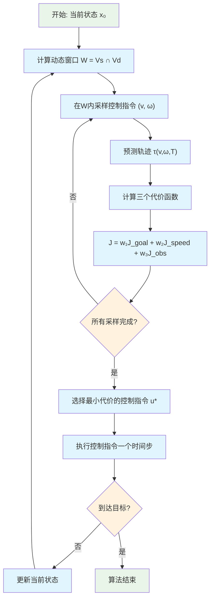

# DWA (Dynamic Window Approach) 算法学习笔记

> **学习日期**: 2026-03-12
> **源代码文件**: [dynamic_window_approach.py](../../../PythonRobotics/PathPlanning/DynamicWindowApproach/dynamic_window_approach.py)
> **算法分类**: 局部路径规划 / 实时避障

---

## 📋 算法概述

### 基本定义
Dynamic Window Approach (DWA) 是一种**实时局部路径规划算法**，专门用于移动机器人在动态环境中的导航和避障。

### 核心思想
DWA 通过在机器人的**动态窗口**内搜索最优的速度和角速度组合，在每个时间步长内选择最安全且最有效的控制指令。

### 算法特点
- ✅ **实时性强**: 滚动优化，每个控制周期重新计算
- ✅ **适应性好**: 能处理动态障碍物和环境变化
- ✅ **计算高效**: 局部搜索，计算量相对较小
- ⚠️ **局部最优**: 不保证全局最优解
- ⚠️ **依赖全局规划**: 通常需要配合全局路径规划使用

---

## 🧮 数学模型

### 1. 机器人运动学模型

DWA 采用**二轮差分驱动模型**，机器人状态向量为：

$$\mathbf{x} = [x, y, \theta, v, \omega]^T$$

其中：
- $(x, y)$: 机器人在世界坐标系中的位置
- $\theta$: 机器人的航向角 (yaw angle)
- $v$: 线速度 (forward velocity)
- $\omega$: 角速度 (yaw rate)

**运动学方程**：
$$\begin{align}
\dot{x} &= v \cos(\theta) \\
\dot{y} &= v \sin(\theta) \\
\dot{\theta} &= \omega \\
\dot{v} &= a \\
\dot{\omega} &= \alpha
\end{align}$$

**离散化运动模型** ([第95-106行](../../../PythonRobotics/PathPlanning/DynamicWindowApproach/dynamic_window_approach.py#L95-L106))：
$$\begin{align}
x_{k+1} &= x_k + v_k \cos(\theta_k) \Delta t \\
y_{k+1} &= y_k + v_k \sin(\theta_k) \Delta t \\
\theta_{k+1} &= \theta_k + \omega_k \Delta t \\
v_{k+1} &= v_k + a_k \Delta t \\
\omega_{k+1} &= \omega_k + \alpha_k \Delta t
\end{align}$$

### 2. 动态窗口约束

**动态窗口** $\mathcal{W}$ 定义为当前时刻机器人能够安全执行的速度空间：

$$\mathcal{W} = \mathcal{V}_s \cap \mathcal{V}_d$$

#### 2.1 机器人规格约束 $\mathcal{V}_s$

$$\mathcal{V}_s = \{(v, \omega) | v_{\min} \leq v \leq v_{\max}, \omega_{\min} \leq \omega \leq \omega_{\max}\}$$

#### 2.2 动态性能约束 $\mathcal{V}_d$

考虑机器人的加速度限制：

$$\mathcal{V}_d = \{(v, \omega) | v_c - a_{\max} \Delta t \leq v \leq v_c + a_{\max} \Delta t, \omega_c - \alpha_{\max} \Delta t \leq \omega \leq \omega_c + \alpha_{\max} \Delta t\}$$

其中 $(v_c, \omega_c)$ 为当前速度状态。

#### 2.3 最终动态窗口

$$\mathcal{W} = [v_{\min}^*, v_{\max}^*, \omega_{\min}^*, \omega_{\max}^*]$$

其中：
$$\begin{align}
v_{\min}^* &= \max(v_{\min}, v_c - a_{\max} \Delta t) \\
v_{\max}^* &= \min(v_{\max}, v_c + a_{\max} \Delta t) \\
\omega_{\min}^* &= \max(\omega_{\min}, \omega_c - \alpha_{\max} \Delta t) \\
\omega_{\max}^* &= \min(\omega_{\max}, \omega_c + \alpha_{\max} \Delta t)
\end{align}$$

### 3. 代价函数设计

DWA 使用三个代价函数的加权和来评估轨迹质量：

$$J_{\text{total}} = w_1 J_{\text{goal}} + w_2 J_{\text{speed}} + w_3 J_{\text{obstacle}}$$

#### 3.1 目标点代价 $J_{\text{goal}}$

基于航向误差而非直接距离：

$$J_{\text{goal}} = |\text{atan2}(\sin(\theta_{\text{error}}), \cos(\theta_{\text{error}}))|$$

其中：
$$\begin{align}
\theta_{\text{target}} &= \text{atan2}(y_g - y_f, x_g - x_f) \\
\theta_{\text{error}} &= \theta_{\text{target}} - \theta_f
\end{align}$$

$(x_f, y_f, \theta_f)$ 为预测轨迹的终点状态，$(x_g, y_g)$ 为目标点。

#### 3.2 速度代价 $J_{\text{speed}}$

鼓励机器人以较高速度运动：

$$J_{\text{speed}} = v_{\max} - v_f$$

其中 $v_f$ 为预测轨迹终点的速度。

#### 3.3 障碍物代价 $J_{\text{obstacle}}$

$$J_{\text{obstacle}} = \begin{cases}
+\infty & \text{if collision detected} \\
\frac{1}{d_{\min}} & \text{otherwise}
\end{cases}$$

其中 $d_{\min}$ 为轨迹上任意点到最近障碍物的距离。

### 4. 代价计算的详细策略

DWA 的三个代价函数采用**不同的计算范围**，这是算法效率与安全性平衡的关键设计：

#### 4.1 目标点代价：仅计算终点

**计算范围**：轨迹终点 `trajectory[-1, :]`
```python
# 只使用预测轨迹的最后一个点
dx = goal[0] - trajectory[-1, 0]  # 终点x与目标x的差
dy = goal[1] - trajectory[-1, 1]  # 终点y与目标y的差
error_angle = math.atan2(dy, dx)
cost_angle = error_angle - trajectory[-1, 2]
```

**设计理由**：
- ✅ **计算高效**：O(1)复杂度，只计算一个点
- ✅ **导航逻辑**：关注"最终能否朝向目标"
- ⚠️ **局限性**：忽略路径中间偏离目标的情况

#### 4.2 速度代价：仅计算终点

**计算范围**：轨迹终点速度 `trajectory[-1, 3]`
```python
# 只使用预测轨迹终点的速度
speed_cost = config.speed_cost_gain * (config.max_speed - trajectory[-1, 3])
```

**设计理由**：
- ✅ **鼓励高速到达**：确保机器人以较高速度接近目标
- ✅ **避免急停**：防止为了避障而过度减速
- ⚠️ **忽略过程**：不关心中间速度变化的平滑性

#### 4.3 障碍物代价：检查整条轨迹

**计算范围**：轨迹上所有点 `trajectory[:, 0:2]`

**关键实现** ([第190-192行](../../../PythonRobotics/PathPlanning/DynamicWindowApproach/dynamic_window_approach.py#L190-L192))：
```python
# 计算轨迹上每个点到所有障碍物的距离
dx = trajectory[:, 0] - ox[:, None]  # 所有轨迹点的x坐标
dy = trajectory[:, 1] - oy[:, None]  # 所有轨迹点的y坐标
r = np.hypot(dx, dy)  # 距离矩阵 [轨迹点数 × 障碍物数]
```

**碰撞检测机制**：

1. **圆形机器人** ([第210-211行](../../../PythonRobotics/PathPlanning/DynamicWindowApproach/dynamic_window_approach.py#L210-L211))：
   ```python
   if np.array(r <= config.robot_radius).any():
       return float("Inf")  # 任意点碰撞 → 无穷大代价
   ```

2. **矩形机器人** ([第194-208行](../../../PythonRobotics/PathPlanning/DynamicWindowApproach/dynamic_window_approach.py#L194-L208))：
   - 计算每个轨迹点的旋转矩阵
   - 将障碍物转换到机器人局部坐标系
   - 检查障碍物是否在机器人矩形范围内

3. **安全距离代价**：
   ```python
   min_r = np.min(r)  # 整条轨迹到所有障碍物的最小距离
   return 1.0 / min_r  # 距离越近，代价越高
   ```

**安全策略优势**：
- ✅ **完全安全**：确保路径中任何一点都不会碰撞
- ✅ **距离感知**：越接近障碍物代价越高
- ⚠️ **计算密集**：O(轨迹长度 × 障碍物数量)

#### 4.4 代价计算策略总结

| 代价函数 | 计算范围 | 复杂度 | 目的 | 安全性 |
|---------|---------|-------|-----|--------|
| **目标代价** | 终点 | O(1) | 导航效率 | - |
| **速度代价** | 终点 | O(1) | 运动效率 | - |
| **障碍代价** | 全轨迹 | O(N×M) | 碰撞避免 | 最高 |

*N = 轨迹点数, M = 障碍物数量*

### 5. 采样策略深入分析

#### 5.1 控制空间采样 vs 路径空间采样

**DWA 的核心设计**：在**控制空间** $(v, \omega)$ 采样，而非路径空间采样

```python
# 第158-159行：双重循环采样控制指令
for v in np.arange(dw[0], dw[1], config.v_resolution):      # 线速度采样
    for y in np.arange(dw[2], dw[3], config.yaw_rate_resolution):  # 角速度采样
        trajectory = predict_trajectory(x_init, v, y, config)  # 同一控制持续T秒
```

**采样示例**：
假设动态窗口为 `[0.0, 1.0, -0.5, 0.5]`，分辨率为 0.1：
```
采样得到 11×11 = 121 个控制组合：
(v=0.0, ω=-0.5), (v=0.0, ω=-0.4), ..., (v=0.0, ω=0.5)
(v=0.1, ω=-0.5), (v=0.1, ω=-0.4), ..., (v=0.1, ω=0.5)
...
(v=1.0, ω=-0.5), (v=1.0, ω=-0.4), ..., (v=1.0, ω=0.5)
```

#### 5.2 轨迹预测：固定控制假设

**关键假设**：在整个预测时长内使用**相同的控制指令**

**预测过程** ([第139-142行](../../../PythonRobotics/PathPlanning/DynamicWindowApproach/dynamic_window_approach.py#L139-L142))：
```python
while time <= config.predict_time:  # 默认预测3秒
    x = motion(x, [v, y], config.dt)  # 应用相同控制 (v,ω)
    trajectory = np.vstack((trajectory, x))
    time += config.dt  # 每0.1秒更新一次状态
```

**轨迹生成示例**：
```
控制指令: (v=0.8 m/s, ω=20°/s)
预测轨迹:
t=0.0s: [x=0.0, y=0.0, θ=0°]
t=0.1s: [x=0.08, y=0.00, θ=2°] ← 应用 (0.8, 20°/s)
t=0.2s: [x=0.16, y=0.01, θ=4°] ← 应用 (0.8, 20°/s)
...
t=3.0s: [x=2.1, y=0.8, θ=60°] ← 应用 (0.8, 20°/s)
```

#### 5.3 与其他方法的采样对比

| 算法 | 采样空间 | 采样策略 | 轨迹生成 | 优化目标 |
|------|---------|---------|---------|---------|
| **DWA** | 控制空间(v,ω) | 等间距网格 | 固定控制预测 | 多目标加权和 |
| **MPC** | 控制序列 | 优化求解 | 变化控制预测 | 全局最优 |
| **RRT** | 配置空间(x,y,θ) | 随机采样 | 运动学约束 | 可达性 |
| **A*** | 离散格点 | 系统搜索 | 几何路径 | 最短距离 |

#### 5.4 采样密度的权衡

**高分辨率采样** (v_resolution=0.01, yaw_rate_resolution=0.01)：
```
采样数量: 100×100 = 10,000 个控制组合
优势: 更精细的控制选择，更平滑的轨迹
劣势: 计算量大 (10,000×30点×5障碍物 = 1.5M次距离计算)
适用: 精确控制场景，计算资源充足
```

**低分辨率采样** (v_resolution=0.2, yaw_rate_resolution=0.2)：
```
采样数量: 5×5 = 25 个控制组合
优势: 计算快速 (25×30×5 = 3.75K次距离计算)
劣势: 可能错过最优解，轨迹不够平滑
适用: 实时性要求高，环境相对简单
```

#### 5.5 DWA vs MPC：控制哲学差异

**DWA 控制策略**：
```python
# 每次规划：单一控制指令
best_control = (v*, ω*)  # 选择最优的固定控制
execute(best_control, dt=0.1)  # 只执行一个时间步
replan()  # 立即重新规划
```

**MPC 控制策略**：
```python
# 每次规划：控制序列
optimal_sequence = [u₀, u₁, u₂, ..., u₂₉]  # 30个不同控制指令
execute(optimal_sequence[0:3])  # 执行前几个控制指令
replan()  # 较少频率重新规划
```

**设计权衡分析**：

| 特性 | DWA | MPC |
|------|-----|-----|
| **计算复杂度** | O(N) 枚举 | O(N³) 优化求解 |
| **实时性** | 10ms | 50-100ms |
| **前瞻性** | 预测但不执行 | 多步执行 |
| **鲁棒性** | 高频重规划适应变化 | 依赖模型精度 |
| **最优性** | 局部贪婪 | 全局最优（线性化范围内） |

---

## 🔄 算法工作流程

### 主要流程图



### 详细算法步骤

#### 步骤 1: 动态窗口计算
**函数**: [calc_dynamic_window()](../../../PythonRobotics/PathPlanning/DynamicWindowApproach/dynamic_window_approach.py#L109-L128)

1. 计算机器人规格约束 $\mathcal{V}_s$
2. 计算动态性能约束 $\mathcal{V}_d$
3. 求交集得到可行控制空间 $\mathcal{W}$

#### 步骤 2: 控制空间采样
**函数**: [calc_control_and_trajectory()](../../../PythonRobotics/PathPlanning/DynamicWindowApproach/dynamic_window_approach.py#L147-L181)

**采样过程**：
```python
for v in np.arange(dw[0], dw[1], config.v_resolution):
    for ω in np.arange(dw[2], dw[3], config.yaw_rate_resolution):
        # 每个 (v, ω) 组合代表一种控制策略
        candidate_controls.append((v, ω))
```

**关键特点**：
- **控制空间采样**：不是在路径空间采样点，而是采样控制指令
- **固定控制假设**：每个候选在整个预测时长内使用相同的 $(v, \omega)$
- **网格化搜索**：等间距采样保证搜索的系统性

#### 步骤 3: 轨迹预测与评估
对每个采样的控制指令 $(v_i, \omega_j)$：

1. **轨迹预测** ([predict_trajectory()](../../../PythonRobotics/PathPlanning/DynamicWindowApproach/dynamic_window_approach.py#L131-L144))：
   ```python
   trajectory = []
   for t in range(int(config.predict_time / config.dt)):  # 30步
       x = motion(x, [v_i, ω_j], config.dt)  # 相同控制
       trajectory.append(x)
   ```

2. **代价计算**：
   - **目标代价**: 只评估轨迹终点 `trajectory[-1]`
   - **速度代价**: 只评估终点速度 `trajectory[-1, 3]`
   - **障碍代价**: 评估整条轨迹 `trajectory[:]` 的每个点

3. **总代价**:
   ```python
   total_cost = w₁×goal_cost + w₂×speed_cost + w₃×obstacle_cost
   ```

#### 步骤 4: 最优控制选择

**优化目标**：
$$\mathbf{u}^* = \arg\min_{(v,\omega) \in \mathcal{W}} J_{\text{total}}(v, \omega)$$

**选择策略**：
```python
if total_cost < min_cost:
    min_cost = total_cost
    best_control = (v_i, ω_j)
    best_trajectory = trajectory
```

**防卡死机制** ([第174-180行](../../../PythonRobotics/PathPlanning/DynamicWindowApproach/dynamic_window_approach.py#L174-L180))：
```python
# 如果最优控制接近零（可能卡死）
if abs(best_u[0]) < threshold and abs(current_v) < threshold:
    best_u[1] = -max_yaw_rate  # 强制旋转逃脱
```

#### 步骤 5: 执行与滚动优化

**执行策略**：
- 只执行选定控制指令的**一个时间步** (dt = 0.1s)
- 更新机器人状态
- 立即重新开始整个规划流程

**滚动优化特点**：
- **高频重规划**: 每0.1秒重新计算
- **适应性强**: 能快速响应环境变化
- **计算负担**: 每秒需要10次完整的采样评估

---

## 💻 核心代码分析

### 1. 主控制函数

[dwa_control()](../../../PythonRobotics/PathPlanning/DynamicWindowApproach/dynamic_window_approach.py#L18-L26) 是算法的入口：

```python
def dwa_control(x, config, goal, ob):
    """Dynamic Window Approach control"""
    dw = calc_dynamic_window(x, config)                    # 计算动态窗口
    u, trajectory = calc_control_and_trajectory(x, dw, config, goal, ob)  # 轨迹优化
    return u, trajectory
```

### 2. 动态窗口计算

[calc_dynamic_window()](../../../PythonRobotics/PathPlanning/DynamicWindowApproach/dynamic_window_approach.py#L109-L128) 实现约束交集：

```python
def calc_dynamic_window(x, config):
    # 机器人规格约束 Vs
    Vs = [config.min_speed, config.max_speed,
          -config.max_yaw_rate, config.max_yaw_rate]

    # 动态性能约束 Vd
    Vd = [x[3] - config.max_accel * config.dt,
          x[3] + config.max_accel * config.dt,
          x[4] - config.max_delta_yaw_rate * config.dt,
          x[4] + config.max_delta_yaw_rate * config.dt]

    # 约束交集
    dw = [max(Vs[0], Vd[0]), min(Vs[1], Vd[1]),
          max(Vs[2], Vd[2]), min(Vs[3], Vd[3])]
    return dw
```

### 3. 轨迹预测

[predict_trajectory()](../../../PythonRobotics/PathPlanning/DynamicWindowApproach/dynamic_window_approach.py#L131-L144) 实现运动学仿真：

```python
def predict_trajectory(x_init, v, y, config):
    x = np.array(x_init)
    trajectory = np.array(x)
    time = 0
    while time <= config.predict_time:  # 预测3秒
        x = motion(x, [v, y], config.dt)  # 运动学更新
        trajectory = np.vstack((trajectory, x))
        time += config.dt
    return trajectory
```

### 4. 防卡死机制

[第174-180行](../../../PythonRobotics/PathPlanning/DynamicWindowApproach/dynamic_window_approach.py#L174-L180) 实现局部最优逃逸：

```python
if abs(best_u[0]) < config.robot_stuck_flag_cons \
        and abs(x[3]) < config.robot_stuck_flag_cons:
    # 当最优速度接近0且当前速度也接近0时
    # 强制施加角速度以逃离局部最优
    best_u[1] = -config.max_delta_yaw_rate
```

---

## ⚙️ 参数配置与调优

### 关键参数说明

| 参数类别 | 参数名 | 默认值 | 说明 | 调优建议 |
|---------|--------|--------|------|---------|
| **速度限制** | `max_speed` | 1.0 m/s | 最大线速度 | 根据机器人性能设置 |
| | `min_speed` | -0.5 m/s | 最小线速度（倒车） | 通常为负值或0 |
| | `max_yaw_rate` | 40°/s | 最大角速度 | 影响转弯灵活性 |
| **动态约束** | `max_accel` | 0.2 m/s² | 最大加速度 | 决定动态窗口大小 |
| | `max_delta_yaw_rate` | 40°/s² | 最大角加速度 | 影响转向平滑性 |
| **采样精度** | `v_resolution` | 0.01 m/s | 速度采样间隔 | 精度vs计算量权衡 |
| | `yaw_rate_resolution` | 0.1°/s | 角速度采样间隔 | 精度vs计算量权衡 |
| **预测参数** | `predict_time` | 3.0 s | 轨迹预测时长 | 影响前瞻性和计算量 |
| | `dt` | 0.1 s | 时间步长 | 影响预测精度 |
| **代价权重** | `to_goal_cost_gain` | 0.15 | 目标代价权重 | 调节导航积极性 |
| | `speed_cost_gain` | 1.0 | 速度代价权重 | 调节速度偏好 |
| | `obstacle_cost_gain` | 1.0 | 障碍物代价权重 | 调节安全性 |

### 参数调优策略

#### 1. 导航行为调整
```python
# 更积极的目标导向
config.to_goal_cost_gain = 0.5  # 增大 → 更直接朝目标
config.speed_cost_gain = 0.5    # 减小 → 减少对高速的偏好

# 更保守的避障
config.obstacle_cost_gain = 2.0  # 增大 → 更早避障
config.robot_radius = 1.2        # 增大 → 更大安全边距
```

#### 2. 运动平滑性
```python
# 更平滑的运动
config.max_accel = 0.1           # 减小 → 更平滑的加速
config.max_delta_yaw_rate = 20   # 减小 → 更平滑的转向
config.dt = 0.05                 # 减小 → 更精细的控制
```

#### 3. 计算效率优化
```python
# 提高实时性
config.v_resolution = 0.05       # 增大 → 减少采样点
config.yaw_rate_resolution = 0.2 # 增大 → 减少采样点
config.predict_time = 2.0        # 减小 → 减少预测步数
```

---

## 🎯 实际应用指导

### 1. 常见问题与解决方案

#### 问题1: 机器人在障碍物前震荡
**原因**: 代价函数权重不平衡
**解决**: 增大 `obstacle_cost_gain`，减小 `to_goal_cost_gain`

#### 问题2: 机器人运动过于保守
**原因**: 安全边距过大或障碍物代价过高
**解决**: 减小 `robot_radius` 或 `obstacle_cost_gain`

#### 问题3: 轨迹不够平滑
**原因**: 采样分辨率过粗或动态约束过松
**解决**: 减小分辨率参数，增强动态约束

### 2. 与全局规划的集成

DWA 通常与全局路径规划算法配合使用：

```
全局规划 (A*, RRT) → 参考路径 → DWA局部规划 → 控制指令
```

**集成方式**:
1. 全局规划提供粗略路径点
2. DWA 以最近路径点作为局部目标
3. 动态更新局部目标以跟随全局路径

### 3. 实时性能优化

- **并行计算**: 轨迹评估可并行化
- **采样策略**: 使用自适应采样减少计算量
- **预计算**: 预计算常用的代价函数查找表

---

## 🔍 算法比较与扩展

### 与其他局部规划算法比较

| 算法 | 实时性 | 避障能力 | 路径质量 | 参数调节 |
|------|--------|----------|----------|----------|
| **DWA** | 🟢 高 | 🟢 强 | 🟡 中等 | 🟡 中等 |
| Potential Field | 🟢 高 | 🔴 弱 | 🔴 差 | 🟢 简单 |
| TEB | 🟡 中等 | 🟢 强 | 🟢 高 | 🔴 复杂 |
| MPC | 🔴 低 | 🟢 强 | 🟢 高 | 🔴 复杂 |

### 可能的改进方向

1. **时间优化 DWA**: 考虑时间维度的轨迹规划
2. **自适应采样**: 根据环境复杂度调整采样密度
3. **多目标优化**: 引入更多约束（舒适度、能耗等）
4. **学习增强**: 使用机器学习优化代价函数权重

---

## 📚 学习总结

### 核心收获

1. **动态窗口概念**: 物理约束与动态约束的巧妙结合
2. **实时优化思想**: 滚动优化框架的优势与局限性
3. **多目标平衡**: 目标导向、效率与安全的权衡设计
4. **工程实践**: 防卡死机制等实际问题的解决方案
5. **采样策略理解**: 控制空间采样 vs 路径空间采样的本质区别
6. **代价计算智慧**: 不同代价函数使用不同计算范围的设计哲学
7. **实时性权衡**: 单一控制+高频重规划 vs 控制序列+低频重规划

### 深层理解

#### 设计哲学层面
- **控制空间采样**: DWA 在控制指令空间采样，每个样本代表一种"驾驶策略"
- **固定控制假设**: 预测时假设使用相同控制，简化计算但保证实时性
- **分层安全策略**: 目标和速度看终点（效率），避障看全程（安全）

#### 计算复杂度层面
- **差异化计算**: 根据代价函数重要性分配不同计算复杂度
- **实时性保证**: 通过限制采样数量和简化预测模型实现10ms级响应
- **安全性保证**: 通过全轨迹碰撞检测确保路径安全

#### 控制理论层面
- **MPC思想应用**: 预测-优化-执行的滚动优化框架
- **贪婪式决策**: 每次只选择当前最优，依靠高频重规划适应变化
- **鲁棒性设计**: 防卡死机制和多目标平衡提高算法鲁棒性

### 进阶学习建议

1. 尝试调整参数观察行为变化
2. 实现与全局规划的集成
3. 对比其他局部规划算法
4. 研究动态环境下的性能表现

---

**学习完成日期**: 2026-03-12
**理解程度**: ⭐⭐⭐⭐⭐ (完全掌握)
**下一步计划**: 学习 TEB (Timed Elastic Band) 算法，对比不同局部规划方法